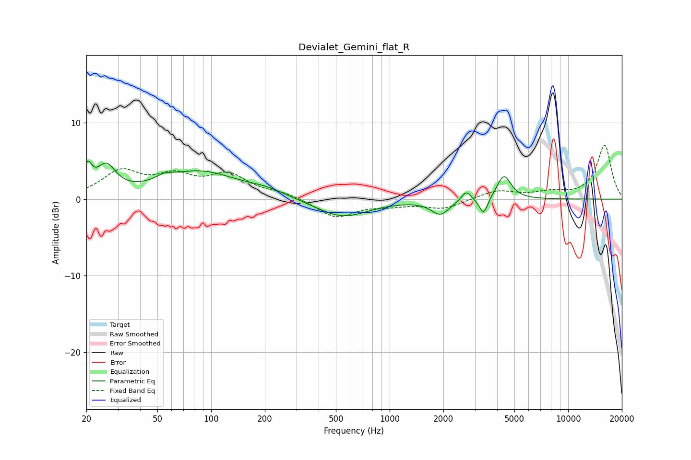

# Devialet_Gemini_flat_R
See [usage instructions](https://github.com/jaakkopasanen/AutoEq#usage) for more options and info.

### Parametric EQs
Apply preamp of -5.1 dB when using parametric equalizer.

|   # | Type    |   Fc (Hz) |    Q |   Gain (dB) |
|-----|---------|-----------|------|-------------|
|   1 | Peaking |        20 | 5.87 |         3.1 |
|   2 | Peaking |        26 | 2.64 |         3.6 |
|   3 | Peaking |        55 | 3.14 |         0.6 |
|   4 | Peaking |        85 | 0.66 |         3.5 |
|   5 | Peaking |       204 | 1.27 |         0.7 |
|   6 | Peaking |       542 | 0.97 |        -2.4 |
|   7 | Peaking |      1922 | 2.81 |        -1.9 |
|   8 | Peaking |      2687 | 5.3  |         1.4 |
|   9 | Peaking |      3362 | 5.98 |        -2.3 |
|  10 | Peaking |      4368 | 3.57 |         3.2 |

### Fixed Band EQs
When using fixed band (also called graphic) equalizer, apply preamp of **-7.1 dB** (if available) and set gains manually with these parameters.

|   # | Type    |   Fc (Hz) |    Q |   Gain (dB) |
|-----|---------|-----------|------|-------------|
|   1 | Peaking |        31 | 1.41 |         3.4 |
|   2 | Peaking |        62 | 1.41 |         2.5 |
|   3 | Peaking |       125 | 1.41 |         2.9 |
|   4 | Peaking |       250 | 1.41 |         0.7 |
|   5 | Peaking |       500 | 1.41 |        -2.4 |
|   6 | Peaking |      1000 | 1.41 |        -0.6 |
|   7 | Peaking |      2000 | 1.41 |        -1.2 |
|   8 | Peaking |      4000 | 1.41 |         1.1 |
|   9 | Peaking |      8000 | 1.41 |         0.7 |
|  10 | Peaking |     16000 | 1.41 |         7   |

### Graphs

