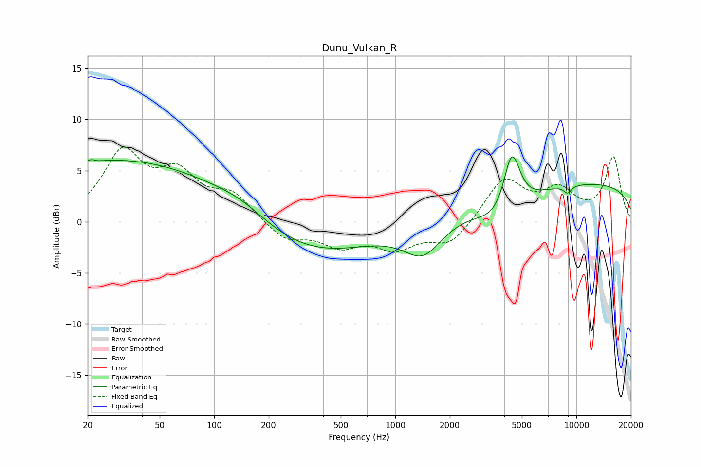

# Dunu_Vulkan_R
See [usage instructions](https://github.com/jaakkopasanen/AutoEq#usage) for more options and info.

### Parametric EQs
Apply preamp of -6.4 dB when using parametric equalizer.

|   # | Type    |   Fc (Hz) |    Q |   Gain (dB) |
|-----|---------|-----------|------|-------------|
|   1 | Peaking |        21 | 5.92 |         2.8 |
|   2 | Peaking |        21 | 5.78 |        -2.7 |
|   3 | Peaking |        33 | 0.2  |         6.2 |
|   4 | Peaking |       142 | 0.87 |         1.4 |
|   5 | Peaking |       283 | 0.37 |        -3.9 |
|   6 | Peaking |      1428 | 1.3  |        -3.4 |
|   7 | Peaking |      4002 | 1.13 |        -3.7 |
|   8 | Peaking |      4395 | 2.83 |         6.8 |
|   9 | Peaking |      8936 | 6    |        -0.7 |
|  10 | Peaking |      9695 | 0.18 |         3.9 |

### Fixed Band EQs
When using fixed band (also called graphic) equalizer, apply preamp of **-7.4 dB** (if available) and set gains manually with these parameters.

|   # | Type    |   Fc (Hz) |    Q |   Gain (dB) |
|-----|---------|-----------|------|-------------|
|   1 | Peaking |        31 | 1.41 |         6.4 |
|   2 | Peaking |        62 | 1.41 |         4   |
|   3 | Peaking |       125 | 1.41 |         2.4 |
|   4 | Peaking |       250 | 1.41 |        -1.8 |
|   5 | Peaking |       500 | 1.41 |        -2.1 |
|   6 | Peaking |      1000 | 1.41 |        -2.3 |
|   7 | Peaking |      2000 | 1.41 |        -2.2 |
|   8 | Peaking |      4000 | 1.41 |         4.2 |
|   9 | Peaking |      8000 | 1.41 |         2.8 |
|  10 | Peaking |     16000 | 1.41 |         6.2 |

### Graphs

