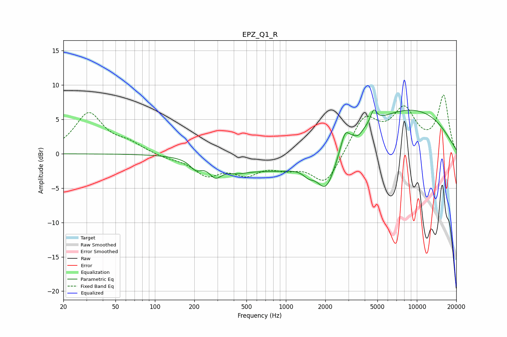

# EPZ_Q1_R
See [usage instructions](https://github.com/jaakkopasanen/AutoEq#usage) for more options and info.

### Parametric EQs
Apply preamp of -6.5 dB when using parametric equalizer.

|   # | Type    |   Fc (Hz) |    Q |   Gain (dB) |
|-----|---------|-----------|------|-------------|
|   1 | Peaking |       205 | 3.27 |        -1.3 |
|   2 | Peaking |       289 | 3.01 |        -1.9 |
|   3 | Peaking |       415 | 1.56 |        -0.9 |
|   4 | Peaking |      1488 | 3.45 |        -1   |
|   5 | Peaking |      1975 | 0.25 |        -4.9 |
|   6 | Peaking |      2031 | 1.97 |        -5.4 |
|   7 | Peaking |      2832 | 4.32 |         2.5 |
|   8 | Peaking |      3581 | 4.95 |        -0.6 |
|   9 | Peaking |      4681 | 5.91 |         1.9 |
|  10 | Peaking |      6092 | 0.26 |         8.9 |

### Fixed Band EQs
When using fixed band (also called graphic) equalizer, apply preamp of **-8.6 dB** (if available) and set gains manually with these parameters.

|   # | Type    |   Fc (Hz) |    Q |   Gain (dB) |
|-----|---------|-----------|------|-------------|
|   1 | Peaking |        31 | 1.41 |         5.8 |
|   2 | Peaking |        62 | 1.41 |         1.3 |
|   3 | Peaking |       125 | 1.41 |        -0.5 |
|   4 | Peaking |       250 | 1.41 |        -2.8 |
|   5 | Peaking |       500 | 1.41 |        -2.5 |
|   6 | Peaking |      1000 | 1.41 |        -1.5 |
|   7 | Peaking |      2000 | 1.41 |        -4.5 |
|   8 | Peaking |      4000 | 1.41 |         5.2 |
|   9 | Peaking |      8000 | 1.41 |         5.9 |
|  10 | Peaking |     16000 | 1.41 |         8.2 |

### Graphs

