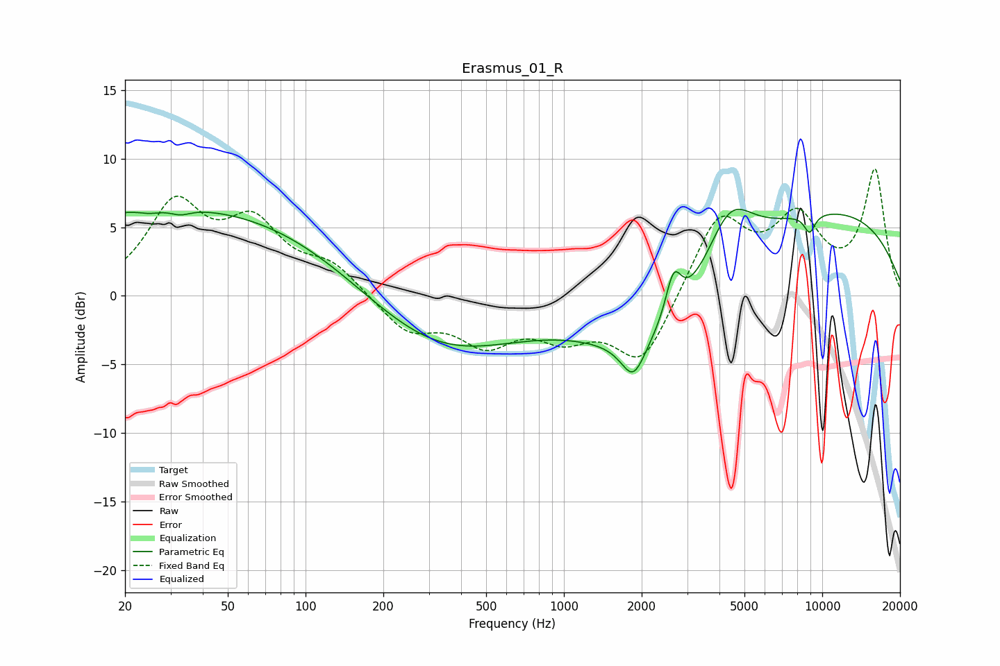

# Erasmus_01_R
See [usage instructions](https://github.com/jaakkopasanen/AutoEq#usage) for more options and info.

### Parametric EQs
Apply preamp of -6.4 dB when using parametric equalizer.

|   # | Type    |   Fc (Hz) |    Q |   Gain (dB) |
|-----|---------|-----------|------|-------------|
|   1 | Peaking |        25 | 3.59 |        -0.3 |
|   2 | Peaking |        33 | 3.65 |        -0.4 |
|   3 | Peaking |        34 | 0.2  |         6.6 |
|   4 | Peaking |       319 | 0.46 |        -4.6 |
|   5 | Peaking |      1856 | 3.06 |        -2.7 |
|   6 | Peaking |      2323 | 0.56 |        -4.9 |
|   7 | Peaking |      2656 | 4.66 |         3.2 |
|   8 | Peaking |      4368 | 1.5  |         4.7 |
|   9 | Peaking |      8932 | 5.99 |        -1.3 |
|  10 | Peaking |     10000 | 0.28 |         6.3 |

### Fixed Band EQs
When using fixed band (also called graphic) equalizer, apply preamp of **-9.3 dB** (if available) and set gains manually with these parameters.

|   # | Type    |   Fc (Hz) |    Q |   Gain (dB) |
|-----|---------|-----------|------|-------------|
|   1 | Peaking |        31 | 1.41 |         6.3 |
|   2 | Peaking |        62 | 1.41 |         4.7 |
|   3 | Peaking |       125 | 1.41 |         2   |
|   4 | Peaking |       250 | 1.41 |        -2.5 |
|   5 | Peaking |       500 | 1.41 |        -3.1 |
|   6 | Peaking |      1000 | 1.41 |        -2.4 |
|   7 | Peaking |      2000 | 1.41 |        -5   |
|   8 | Peaking |      4000 | 1.41 |         5.8 |
|   9 | Peaking |      8000 | 1.41 |         5.2 |
|  10 | Peaking |     16000 | 1.41 |         9   |

### Graphs

