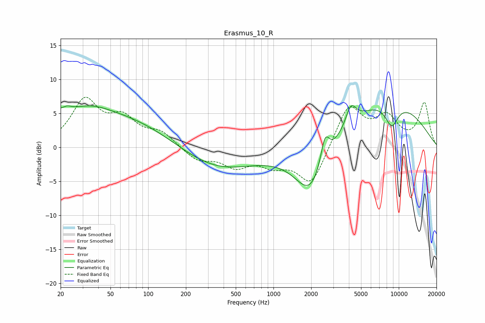

# Erasmus_10_R
See [usage instructions](https://github.com/jaakkopasanen/AutoEq#usage) for more options and info.

### Parametric EQs
Apply preamp of -6.3 dB when using parametric equalizer.

|   # | Type    |   Fc (Hz) |    Q |   Gain (dB) |
|-----|---------|-----------|------|-------------|
|   1 | Peaking |        21 | 5.83 |        -2.7 |
|   2 | Peaking |        22 | 5.16 |         3.3 |
|   3 | Peaking |        35 | 0.2  |         5.4 |
|   4 | Peaking |        36 | 1.05 |         0.9 |
|   5 | Peaking |       339 | 0.45 |        -3.6 |
|   6 | Peaking |      1988 | 1.09 |        -7.5 |
|   7 | Peaking |      2577 | 4.05 |         4.2 |
|   8 | Peaking |      4147 | 3.29 |         3.1 |
|   9 | Peaking |      8162 | 0.4  |         7.1 |
|  10 | Peaking |      8777 | 2.35 |        -3.6 |

### Fixed Band EQs
When using fixed band (also called graphic) equalizer, apply preamp of **-7.5 dB** (if available) and set gains manually with these parameters.

|   # | Type    |   Fc (Hz) |    Q |   Gain (dB) |
|-----|---------|-----------|------|-------------|
|   1 | Peaking |        31 | 1.41 |         6.6 |
|   2 | Peaking |        62 | 1.41 |         3.7 |
|   3 | Peaking |       125 | 1.41 |         2   |
|   4 | Peaking |       250 | 1.41 |        -1.9 |
|   5 | Peaking |       500 | 1.41 |        -2.5 |
|   6 | Peaking |      1000 | 1.41 |        -2.1 |
|   7 | Peaking |      2000 | 1.41 |        -5.6 |
|   8 | Peaking |      4000 | 1.41 |         6.3 |
|   9 | Peaking |      8000 | 1.41 |         4   |
|  10 | Peaking |     16000 | 1.41 |         6.4 |

### Graphs

