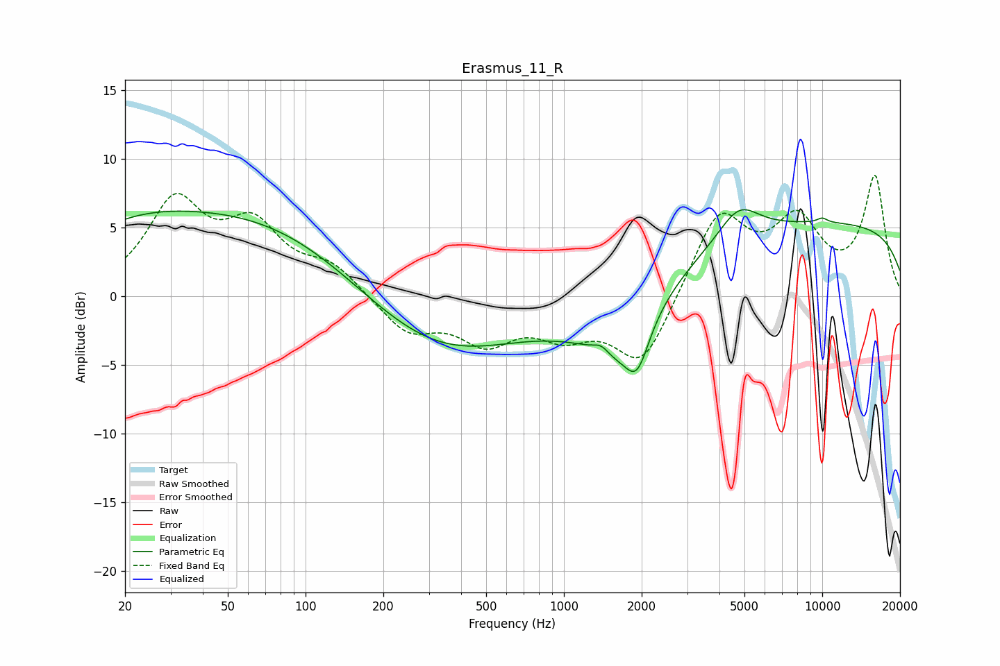

# Erasmus_11_R
See [usage instructions](https://github.com/jaakkopasanen/AutoEq#usage) for more options and info.

### Parametric EQs
Apply preamp of -6.4 dB when using parametric equalizer.

|   # | Type    |   Fc (Hz) |    Q |   Gain (dB) |
|-----|---------|-----------|------|-------------|
|   1 | Peaking |        20 | 0.53 |         3.5 |
|   2 | Peaking |        76 | 0.34 |         5.4 |
|   3 | Peaking |       306 | 0.43 |        -5.1 |
|   4 | Peaking |      1296 | 1.41 |         1.2 |
|   5 | Peaking |      1395 | 4.41 |         0.7 |
|   6 | Peaking |      1536 | 0.95 |        -5.7 |
|   7 | Peaking |      1922 | 3.11 |        -3.1 |
|   8 | Peaking |      4752 | 1.78 |         2.4 |
|   9 | Peaking |     10000 | 0.18 |         5.3 |
|  10 | Peaking |     10000 | 6    |         0.3 |

### Fixed Band EQs
When using fixed band (also called graphic) equalizer, apply preamp of **-8.9 dB** (if available) and set gains manually with these parameters.

|   # | Type    |   Fc (Hz) |    Q |   Gain (dB) |
|-----|---------|-----------|------|-------------|
|   1 | Peaking |        31 | 1.41 |         6.6 |
|   2 | Peaking |        62 | 1.41 |         4.5 |
|   3 | Peaking |       125 | 1.41 |         2   |
|   4 | Peaking |       250 | 1.41 |        -2.6 |
|   5 | Peaking |       500 | 1.41 |        -3   |
|   6 | Peaking |      1000 | 1.41 |        -2.3 |
|   7 | Peaking |      2000 | 1.41 |        -5.1 |
|   8 | Peaking |      4000 | 1.41 |         6.1 |
|   9 | Peaking |      8000 | 1.41 |         5   |
|  10 | Peaking |     16000 | 1.41 |         8.5 |

### Graphs

