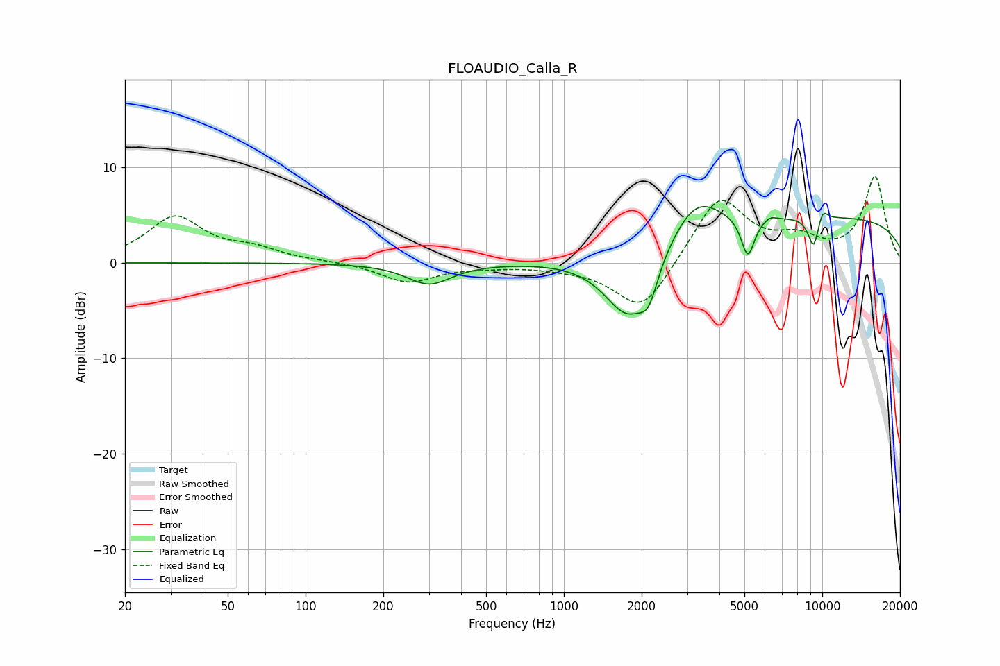

# FLOAUDIO_Calla_R
See [usage instructions](https://github.com/jaakkopasanen/AutoEq#usage) for more options and info.

### Parametric EQs
Apply preamp of -6.0 dB when using parametric equalizer.

|   # | Type    |   Fc (Hz) |    Q |   Gain (dB) |
|-----|---------|-----------|------|-------------|
|   1 | Peaking |       302 | 1.67 |        -2.5 |
|   2 | Peaking |       311 | 1.87 |         0.3 |
|   3 | Peaking |      1766 | 1.5  |        -7.2 |
|   4 | Peaking |      2128 | 4.02 |        -3.1 |
|   5 | Peaking |      3236 | 1.44 |         4.1 |
|   6 | Peaking |      5154 | 5.44 |        -4.2 |
|   7 | Peaking |      6301 | 6    |         0.4 |
|   8 | Peaking |      9278 | 5.8  |        -3.5 |
|   9 | Peaking |     10000 | 5.89 |         1.6 |
|  10 | Peaking |     10000 | 0.18 |         4.8 |

### Fixed Band EQs
When using fixed band (also called graphic) equalizer, apply preamp of **-9.1 dB** (if available) and set gains manually with these parameters.

|   # | Type    |   Fc (Hz) |    Q |   Gain (dB) |
|-----|---------|-----------|------|-------------|
|   1 | Peaking |        31 | 1.41 |         4.7 |
|   2 | Peaking |        62 | 1.41 |         1.2 |
|   3 | Peaking |       125 | 1.41 |         0.1 |
|   4 | Peaking |       250 | 1.41 |        -2   |
|   5 | Peaking |       500 | 1.41 |        -0.3 |
|   6 | Peaking |      1000 | 1.41 |        -0.3 |
|   7 | Peaking |      2000 | 1.41 |        -5.3 |
|   8 | Peaking |      4000 | 1.41 |         7.1 |
|   9 | Peaking |      8000 | 1.41 |         2   |
|  10 | Peaking |     16000 | 1.41 |         9   |

### Graphs

