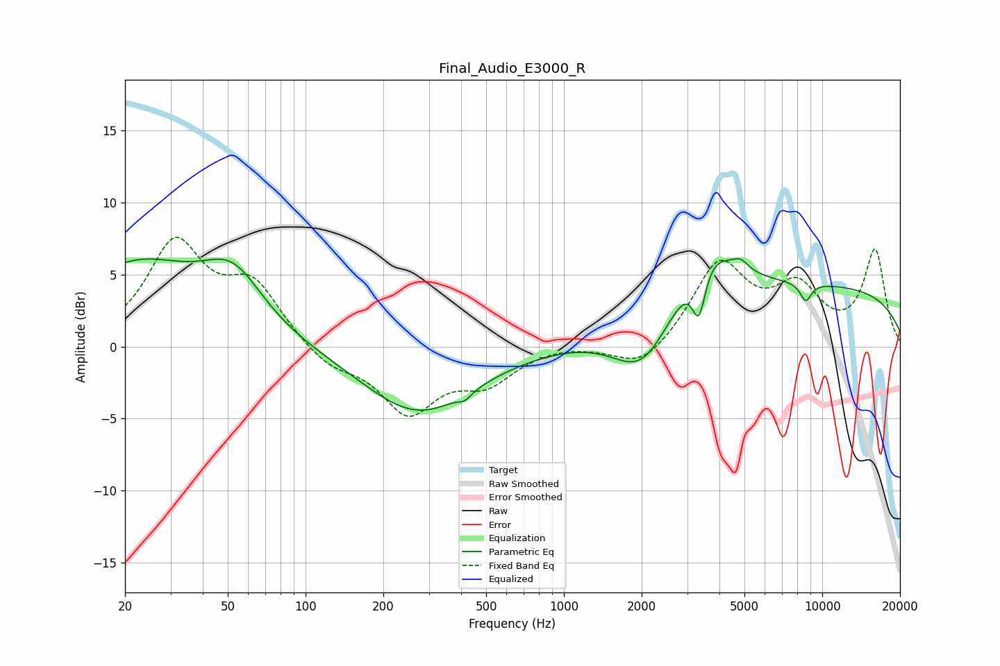

# Final_Audio_E3000_R
See [usage instructions](https://github.com/jaakkopasanen/AutoEq#usage) for more options and info.

### Parametric EQs
Apply preamp of -6.2 dB when using parametric equalizer.

|   # | Type    |   Fc (Hz) |    Q |   Gain (dB) |
|-----|---------|-----------|------|-------------|
|   1 | Peaking |        22 | 0.56 |         5.5 |
|   2 | Peaking |        52 | 1.22 |         3.7 |
|   3 | Peaking |       273 | 0.66 |        -4.7 |
|   4 | Peaking |       414 | 5.81 |        -0.4 |
|   5 | Peaking |      2017 | 1.22 |        -4.1 |
|   6 | Peaking |      3332 | 5.35 |        -3.6 |
|   7 | Peaking |      3566 | 1.27 |         4   |
|   8 | Peaking |      4836 | 5.01 |         0.6 |
|   9 | Peaking |      8636 | 5.86 |        -1.3 |
|  10 | Peaking |      8673 | 0.18 |         4.2 |

### Fixed Band EQs
When using fixed band (also called graphic) equalizer, apply preamp of **-7.7 dB** (if available) and set gains manually with these parameters.

|   # | Type    |   Fc (Hz) |    Q |   Gain (dB) |
|-----|---------|-----------|------|-------------|
|   1 | Peaking |        31 | 1.41 |         6.9 |
|   2 | Peaking |        62 | 1.41 |         3.9 |
|   3 | Peaking |       125 | 1.41 |        -1.4 |
|   4 | Peaking |       250 | 1.41 |        -4.4 |
|   5 | Peaking |       500 | 1.41 |        -2.2 |
|   6 | Peaking |      1000 | 1.41 |         0.2 |
|   7 | Peaking |      2000 | 1.41 |        -1.7 |
|   8 | Peaking |      4000 | 1.41 |         5.7 |
|   9 | Peaking |      8000 | 1.41 |         3.6 |
|  10 | Peaking |     16000 | 1.41 |         6.6 |

### Graphs

