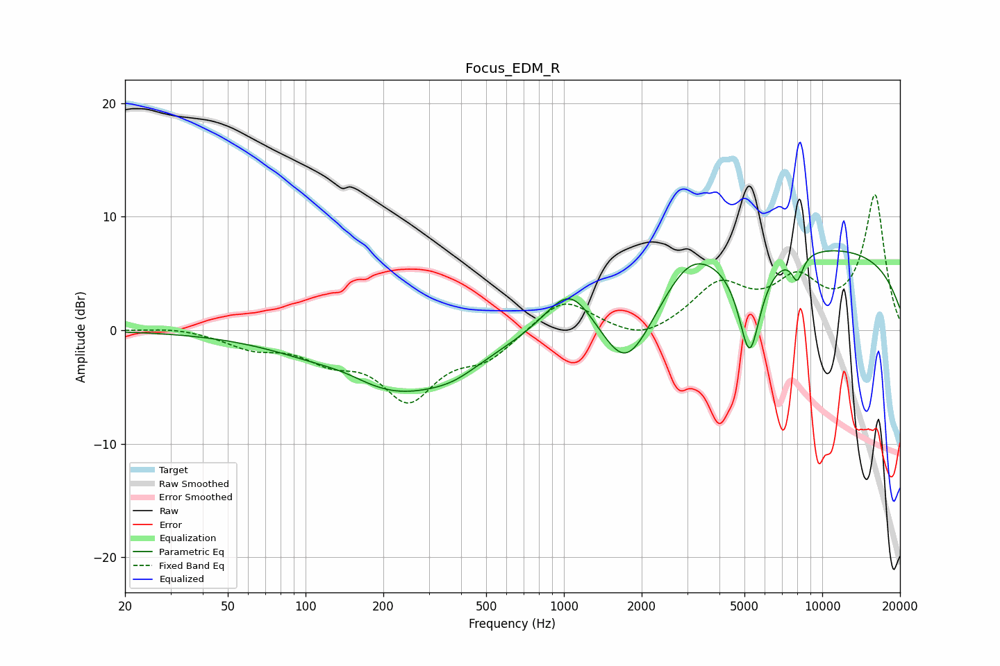

# Focus_EDM_R
See [usage instructions](https://github.com/jaakkopasanen/AutoEq#usage) for more options and info.

### Parametric EQs
Apply preamp of -7.1 dB when using parametric equalizer.

|   # | Type    |   Fc (Hz) |    Q |   Gain (dB) |
|-----|---------|-----------|------|-------------|
|   1 | Peaking |       142 | 1.31 |         0.7 |
|   2 | Peaking |       225 | 0.51 |        -5.6 |
|   3 | Peaking |       375 | 1.62 |        -0.6 |
|   4 | Peaking |      1052 | 1.55 |         3.8 |
|   5 | Peaking |      1736 | 1.37 |        -6.6 |
|   6 | Peaking |      2173 | 1.94 |        -0.4 |
|   7 | Peaking |      3083 | 1.49 |         2.2 |
|   8 | Peaking |      5234 | 3.21 |        -8.7 |
|   9 | Peaking |      8005 | 5.97 |        -2.2 |
|  10 | Peaking |      8567 | 0.18 |         7.4 |

### Fixed Band EQs
When using fixed band (also called graphic) equalizer, apply preamp of **-12.0 dB** (if available) and set gains manually with these parameters.

|   # | Type    |   Fc (Hz) |    Q |   Gain (dB) |
|-----|---------|-----------|------|-------------|
|   1 | Peaking |        31 | 1.41 |         0.3 |
|   2 | Peaking |        62 | 1.41 |        -1.3 |
|   3 | Peaking |       125 | 1.41 |        -2.1 |
|   4 | Peaking |       250 | 1.41 |        -5.7 |
|   5 | Peaking |       500 | 1.41 |        -2.2 |
|   6 | Peaking |      1000 | 1.41 |         3   |
|   7 | Peaking |      2000 | 1.41 |        -1.2 |
|   8 | Peaking |      4000 | 1.41 |         3.8 |
|   9 | Peaking |      8000 | 1.41 |         3.9 |
|  10 | Peaking |     16000 | 1.41 |        11.8 |

### Graphs

