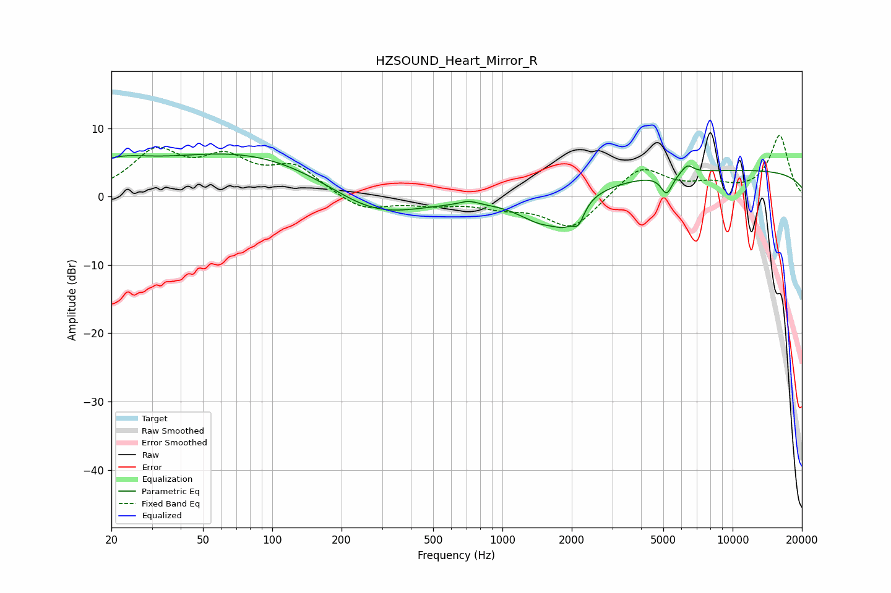

# HZSOUND_Heart_Mirror_R
See [usage instructions](https://github.com/jaakkopasanen/AutoEq#usage) for more options and info.

### Parametric EQs
Apply preamp of -6.3 dB when using parametric equalizer.

|   # | Type    |   Fc (Hz) |    Q |   Gain (dB) |
|-----|---------|-----------|------|-------------|
|   1 | Peaking |        20 | 0.97 |         3.1 |
|   2 | Peaking |        80 | 0.33 |         6.6 |
|   3 | Peaking |       273 | 0.65 |        -4.8 |
|   4 | Peaking |       713 | 3.8  |         0.6 |
|   5 | Peaking |      1513 | 1.29 |        -4.4 |
|   6 | Peaking |      1856 | 3.24 |        -1.9 |
|   7 | Peaking |      2139 | 5.62 |        -2.6 |
|   8 | Peaking |      5174 | 5.65 |        -2.8 |
|   9 | Peaking |      6357 | 5.33 |         1.3 |
|  10 | Peaking |     10000 | 0.18 |         3.9 |

### Fixed Band EQs
When using fixed band (also called graphic) equalizer, apply preamp of **-9.0 dB** (if available) and set gains manually with these parameters.

|   # | Type    |   Fc (Hz) |    Q |   Gain (dB) |
|-----|---------|-----------|------|-------------|
|   1 | Peaking |        31 | 1.41 |         6.2 |
|   2 | Peaking |        62 | 1.41 |         4.8 |
|   3 | Peaking |       125 | 1.41 |         4   |
|   4 | Peaking |       250 | 1.41 |        -2.2 |
|   5 | Peaking |       500 | 1.41 |        -1   |
|   6 | Peaking |      1000 | 1.41 |        -1.3 |
|   7 | Peaking |      2000 | 1.41 |        -4.8 |
|   8 | Peaking |      4000 | 1.41 |         4.5 |
|   9 | Peaking |      8000 | 1.41 |         1.4 |
|  10 | Peaking |     16000 | 1.41 |         8.9 |

### Graphs

