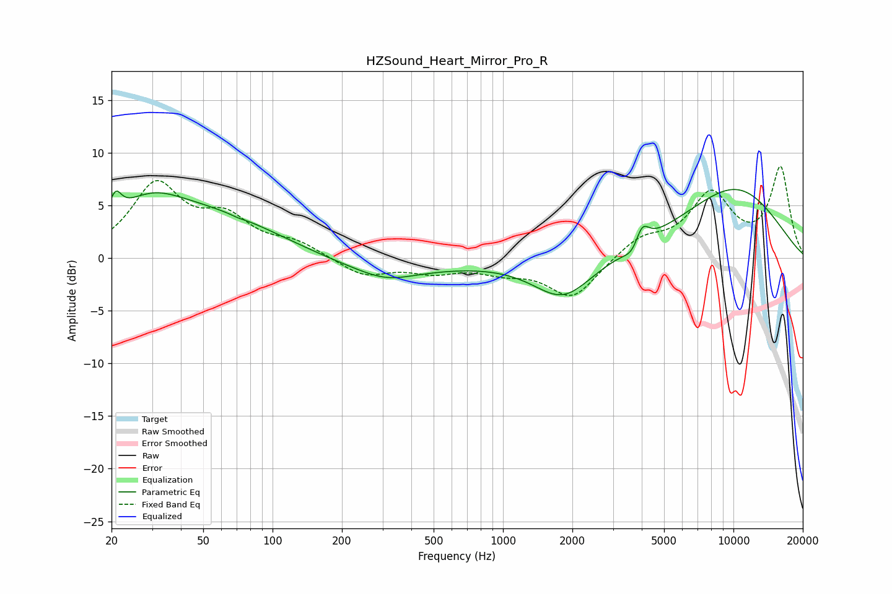

# HZSound_Heart_Mirror_Pro_R
See [usage instructions](https://github.com/jaakkopasanen/AutoEq#usage) for more options and info.

### Parametric EQs
Apply preamp of -6.6 dB when using parametric equalizer.

|   # | Type    |   Fc (Hz) |    Q |   Gain (dB) |
|-----|---------|-----------|------|-------------|
|   1 | Peaking |        21 | 5.81 |         2   |
|   2 | Peaking |        29 | 1.07 |         2.3 |
|   3 | Peaking |        55 | 0.37 |         5.9 |
|   4 | Peaking |        71 | 5.98 |        -0.1 |
|   5 | Peaking |       138 | 0.29 |        -2.5 |
|   6 | Peaking |       310 | 1.19 |        -1   |
|   7 | Peaking |      1825 | 1.09 |        -3.9 |
|   8 | Peaking |      3672 | 3.74 |        -1.2 |
|   9 | Peaking |      4006 | 4.67 |         2.1 |
|  10 | Peaking |     10000 | 0.51 |         6.6 |

### Fixed Band EQs
When using fixed band (also called graphic) equalizer, apply preamp of **-8.8 dB** (if available) and set gains manually with these parameters.

|   # | Type    |   Fc (Hz) |    Q |   Gain (dB) |
|-----|---------|-----------|------|-------------|
|   1 | Peaking |        31 | 1.41 |         6.7 |
|   2 | Peaking |        62 | 1.41 |         3.2 |
|   3 | Peaking |       125 | 1.41 |         1.3 |
|   4 | Peaking |       250 | 1.41 |        -1.7 |
|   5 | Peaking |       500 | 1.41 |        -1.1 |
|   6 | Peaking |      1000 | 1.41 |        -1   |
|   7 | Peaking |      2000 | 1.41 |        -3.8 |
|   8 | Peaking |      4000 | 1.41 |         1.8 |
|   9 | Peaking |      8000 | 1.41 |         5.8 |
|  10 | Peaking |     16000 | 1.41 |         8.4 |

### Graphs

