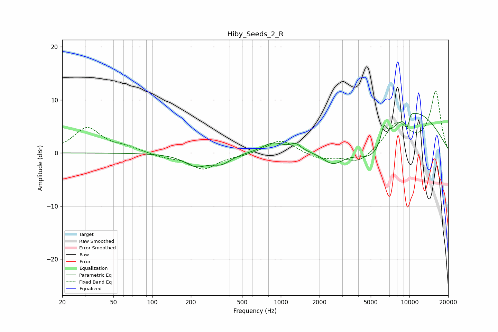

# Hiby_Seeds_2_R
See [usage instructions](https://github.com/jaakkopasanen/AutoEq#usage) for more options and info.

### Parametric EQs
Apply preamp of -7.5 dB when using parametric equalizer.

|   # | Type    |   Fc (Hz) |    Q |   Gain (dB) |
|-----|---------|-----------|------|-------------|
|   1 | Peaking |       220 | 1.57 |        -2.3 |
|   2 | Peaking |       346 | 1.93 |        -1.7 |
|   3 | Peaking |       870 | 1.7  |         1.8 |
|   4 | Peaking |      1306 | 3.56 |         1.2 |
|   5 | Peaking |      2545 | 1.71 |        -2.7 |
|   6 | Peaking |      5286 | 0.88 |        -6.9 |
|   7 | Peaking |      6320 | 5.9  |         3.3 |
|   8 | Peaking |      9300 | 0.4  |         9.6 |
|   9 | Peaking |      9713 | 5.96 |        -3.9 |
|  10 | Peaking |     10000 | 5.69 |         2.1 |

### Fixed Band EQs
When using fixed band (also called graphic) equalizer, apply preamp of **-11.7 dB** (if available) and set gains manually with these parameters.

|   # | Type    |   Fc (Hz) |    Q |   Gain (dB) |
|-----|---------|-----------|------|-------------|
|   1 | Peaking |        31 | 1.41 |         4.7 |
|   2 | Peaking |        62 | 1.41 |         0.9 |
|   3 | Peaking |       125 | 1.41 |        -0.7 |
|   4 | Peaking |       250 | 1.41 |        -3   |
|   5 | Peaking |       500 | 1.41 |        -0.4 |
|   6 | Peaking |      1000 | 1.41 |         2.6 |
|   7 | Peaking |      2000 | 1.41 |        -1.2 |
|   8 | Peaking |      4000 | 1.41 |        -2.1 |
|   9 | Peaking |      8000 | 1.41 |         5.4 |
|  10 | Peaking |     16000 | 1.41 |        11.5 |

### Graphs

