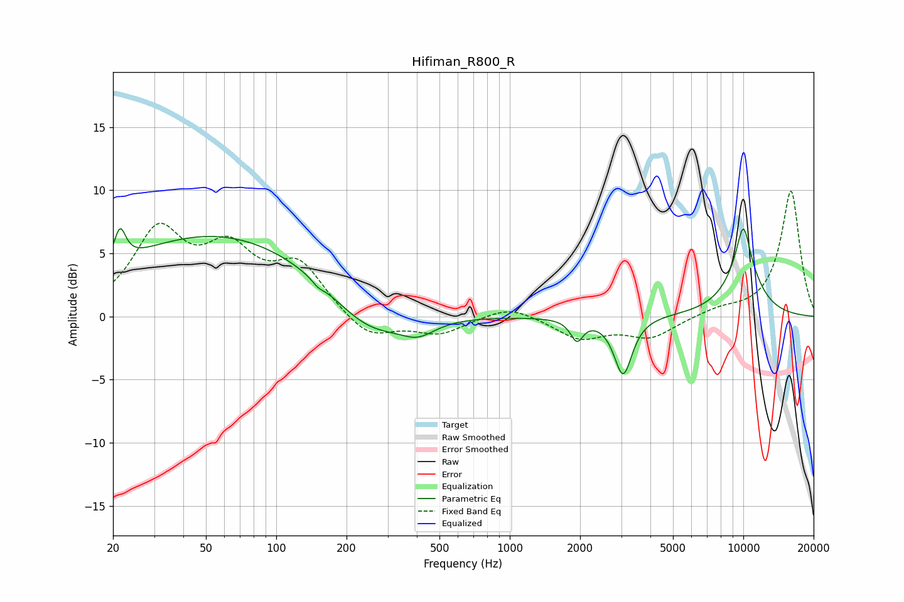

# Hifiman_R800_R
See [usage instructions](https://github.com/jaakkopasanen/AutoEq#usage) for more options and info.

### Parametric EQs
Apply preamp of -7.1 dB when using parametric equalizer.

|   # | Type    |   Fc (Hz) |    Q |   Gain (dB) |
|-----|---------|-----------|------|-------------|
|   1 | Peaking |        21 | 5.85 |         2.6 |
|   2 | Peaking |        56 | 0.31 |         6.5 |
|   3 | Peaking |       151 | 5.88 |        -0.3 |
|   4 | Peaking |       247 | 0.91 |        -2.9 |
|   5 | Peaking |       404 | 1.85 |        -1.3 |
|   6 | Peaking |      1938 | 5.35 |        -1.7 |
|   7 | Peaking |      2850 | 2.55 |        -0.1 |
|   8 | Peaking |      3059 | 3.74 |        -4.5 |
|   9 | Peaking |     10000 | 1.7  |         4.2 |
|  10 | Peaking |     10000 | 4.78 |         2.7 |

### Fixed Band EQs
When using fixed band (also called graphic) equalizer, apply preamp of **-10.0 dB** (if available) and set gains manually with these parameters.

|   # | Type    |   Fc (Hz) |    Q |   Gain (dB) |
|-----|---------|-----------|------|-------------|
|   1 | Peaking |        31 | 1.41 |         6.4 |
|   2 | Peaking |        62 | 1.41 |         4.5 |
|   3 | Peaking |       125 | 1.41 |         3.8 |
|   4 | Peaking |       250 | 1.41 |        -1.9 |
|   5 | Peaking |       500 | 1.41 |        -1.3 |
|   6 | Peaking |      1000 | 1.41 |         1   |
|   7 | Peaking |      2000 | 1.41 |        -1.7 |
|   8 | Peaking |      4000 | 1.41 |        -1.6 |
|   9 | Peaking |      8000 | 1.41 |         0.5 |
|  10 | Peaking |     16000 | 1.41 |        10   |

### Graphs

