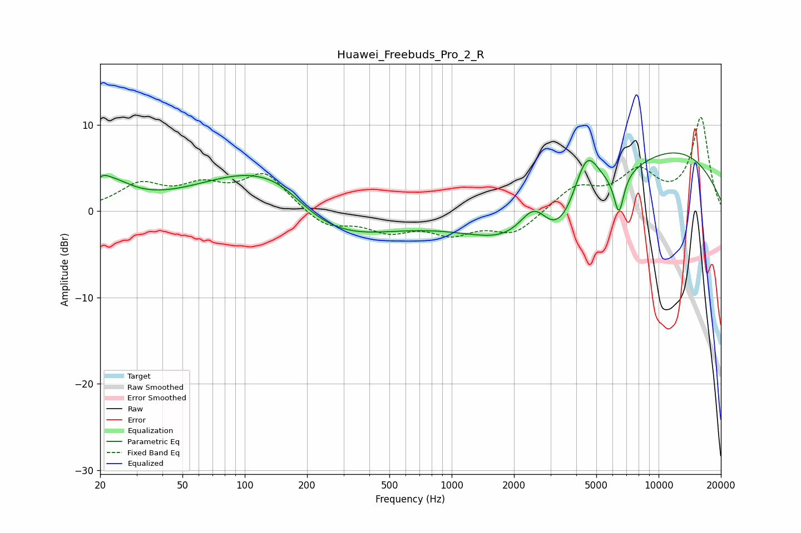

# Huawei_Freebuds_Pro_2_R
See [usage instructions](https://github.com/jaakkopasanen/AutoEq#usage) for more options and info.

### Parametric EQs
Apply preamp of -6.8 dB when using parametric equalizer.

|   # | Type    |   Fc (Hz) |    Q |   Gain (dB) |
|-----|---------|-----------|------|-------------|
|   1 | Peaking |        20 | 4.25 |         1.1 |
|   2 | Peaking |        23 | 1.44 |         2.7 |
|   3 | Peaking |       118 | 0.52 |         6.5 |
|   4 | Peaking |       152 | 1.14 |         1.3 |
|   5 | Peaking |       231 | 0.49 |        -5.5 |
|   6 | Peaking |      2521 | 1.69 |         6.3 |
|   7 | Peaking |      3084 | 0.63 |       -11.3 |
|   8 | Peaking |      4468 | 1.99 |         7.8 |
|   9 | Peaking |      6431 | 5.71 |        -4.6 |
|  10 | Peaking |      9717 | 0.3  |         8.1 |

### Fixed Band EQs
When using fixed band (also called graphic) equalizer, apply preamp of **-10.9 dB** (if available) and set gains manually with these parameters.

|   # | Type    |   Fc (Hz) |    Q |   Gain (dB) |
|-----|---------|-----------|------|-------------|
|   1 | Peaking |        31 | 1.41 |         2.8 |
|   2 | Peaking |        62 | 1.41 |         2.4 |
|   3 | Peaking |       125 | 1.41 |         4.2 |
|   4 | Peaking |       250 | 1.41 |        -1.9 |
|   5 | Peaking |       500 | 1.41 |        -2.1 |
|   6 | Peaking |      1000 | 1.41 |        -2.3 |
|   7 | Peaking |      2000 | 1.41 |        -2.5 |
|   8 | Peaking |      4000 | 1.41 |         2.7 |
|   9 | Peaking |      8000 | 1.41 |         4.1 |
|  10 | Peaking |     16000 | 1.41 |        10.7 |

### Graphs

