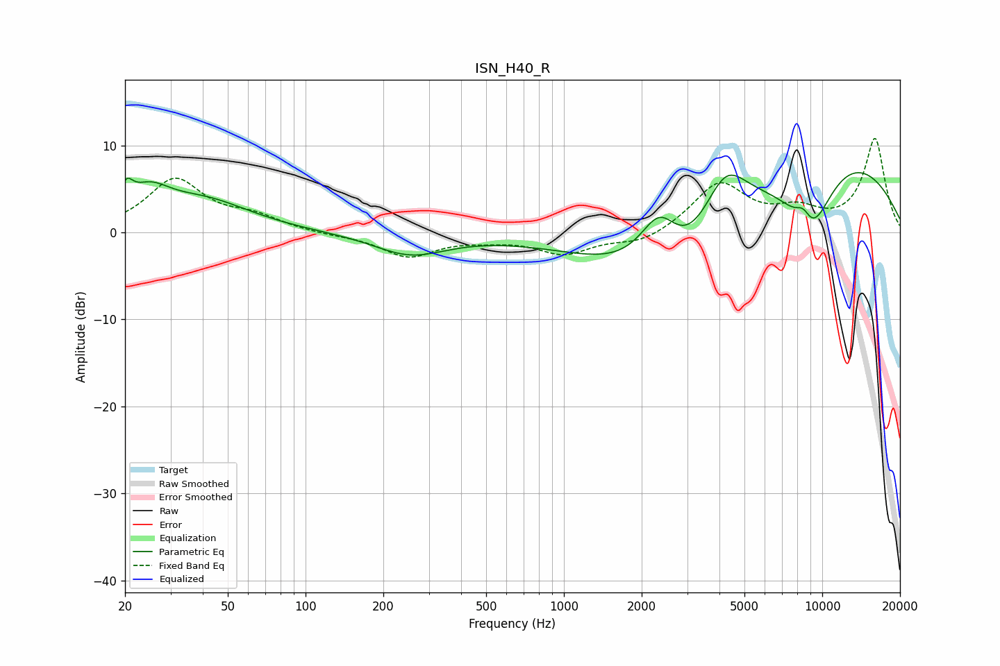

# ISN_H40_R
See [usage instructions](https://github.com/jaakkopasanen/AutoEq#usage) for more options and info.

### Parametric EQs
Apply preamp of -7.0 dB when using parametric equalizer.

|   # | Type    |   Fc (Hz) |    Q |   Gain (dB) |
|-----|---------|-----------|------|-------------|
|   1 | Peaking |        20 | 5.85 |         2.4 |
|   2 | Peaking |        25 | 1.75 |         3.4 |
|   3 | Peaking |        40 | 0.77 |         3.4 |
|   4 | Peaking |       254 | 1    |        -2.5 |
|   5 | Peaking |      2346 | 1.65 |         8.1 |
|   6 | Peaking |      2721 | 0.62 |       -12.1 |
|   7 | Peaking |      4200 | 1.51 |         7.4 |
|   8 | Peaking |      8452 | 4.11 |         2.2 |
|   9 | Peaking |      8971 | 1.17 |       -11.8 |
|  10 | Peaking |      9360 | 0.36 |        13.6 |

### Fixed Band EQs
When using fixed band (also called graphic) equalizer, apply preamp of **-10.9 dB** (if available) and set gains manually with these parameters.

|   # | Type    |   Fc (Hz) |    Q |   Gain (dB) |
|-----|---------|-----------|------|-------------|
|   1 | Peaking |        31 | 1.41 |         6   |
|   2 | Peaking |        62 | 1.41 |         1.5 |
|   3 | Peaking |       125 | 1.41 |        -0.2 |
|   4 | Peaking |       250 | 1.41 |        -2.7 |
|   5 | Peaking |       500 | 1.41 |        -0.6 |
|   6 | Peaking |      1000 | 1.41 |        -2.3 |
|   7 | Peaking |      2000 | 1.41 |        -1.3 |
|   8 | Peaking |      4000 | 1.41 |         5.6 |
|   9 | Peaking |      8000 | 1.41 |         2.1 |
|  10 | Peaking |     16000 | 1.41 |        10.7 |

### Graphs

