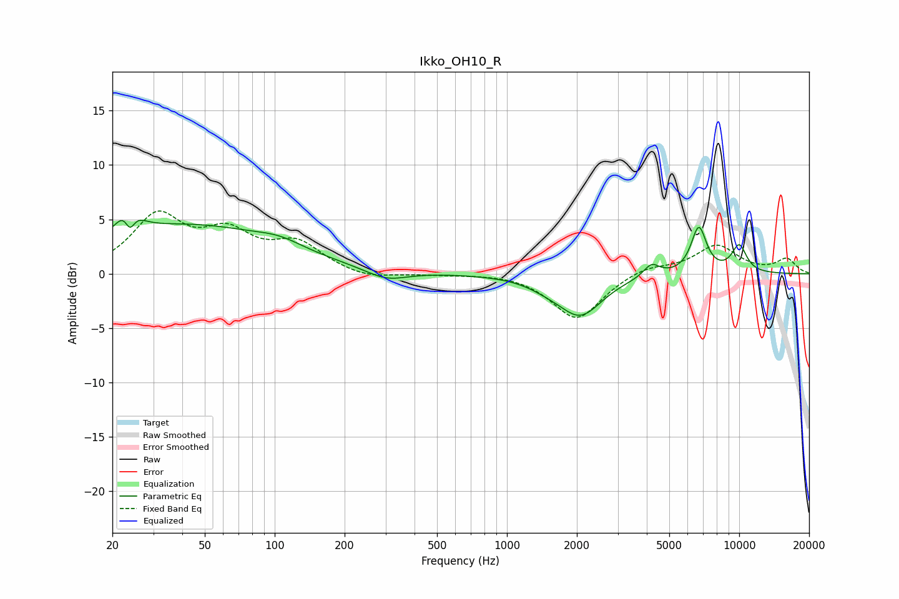

# Ikko_OH10_R
See [usage instructions](https://github.com/jaakkopasanen/AutoEq#usage) for more options and info.

### Parametric EQs
Apply preamp of -5.0 dB when using parametric equalizer.

|   # | Type    |   Fc (Hz) |    Q |   Gain (dB) |
|-----|---------|-----------|------|-------------|
|   1 | Peaking |        23 | 3.52 |         3.9 |
|   2 | Peaking |        24 | 5.83 |        -3.3 |
|   3 | Peaking |        42 | 0.36 |         4.4 |
|   4 | Peaking |       105 | 1.43 |         0.7 |
|   5 | Peaking |       302 | 1.58 |        -1   |
|   6 | Peaking |      1479 | 1.69 |        -0.5 |
|   7 | Peaking |      2071 | 1.49 |        -3.7 |
|   8 | Peaking |      4191 | 4.01 |         1.2 |
|   9 | Peaking |      6701 | 4.09 |         4.2 |
|  10 | Peaking |     10000 | 3.7  |         2.5 |

### Fixed Band EQs
When using fixed band (also called graphic) equalizer, apply preamp of **-5.9 dB** (if available) and set gains manually with these parameters.

|   # | Type    |   Fc (Hz) |    Q |   Gain (dB) |
|-----|---------|-----------|------|-------------|
|   1 | Peaking |        31 | 1.41 |         5.1 |
|   2 | Peaking |        62 | 1.41 |         3.2 |
|   3 | Peaking |       125 | 1.41 |         2.5 |
|   4 | Peaking |       250 | 1.41 |        -0.6 |
|   5 | Peaking |       500 | 1.41 |        -0.1 |
|   6 | Peaking |      1000 | 1.41 |         0.1 |
|   7 | Peaking |      2000 | 1.41 |        -4.2 |
|   8 | Peaking |      4000 | 1.41 |         0.7 |
|   9 | Peaking |      8000 | 1.41 |         2.6 |
|  10 | Peaking |     16000 | 1.41 |         1.3 |

### Graphs

