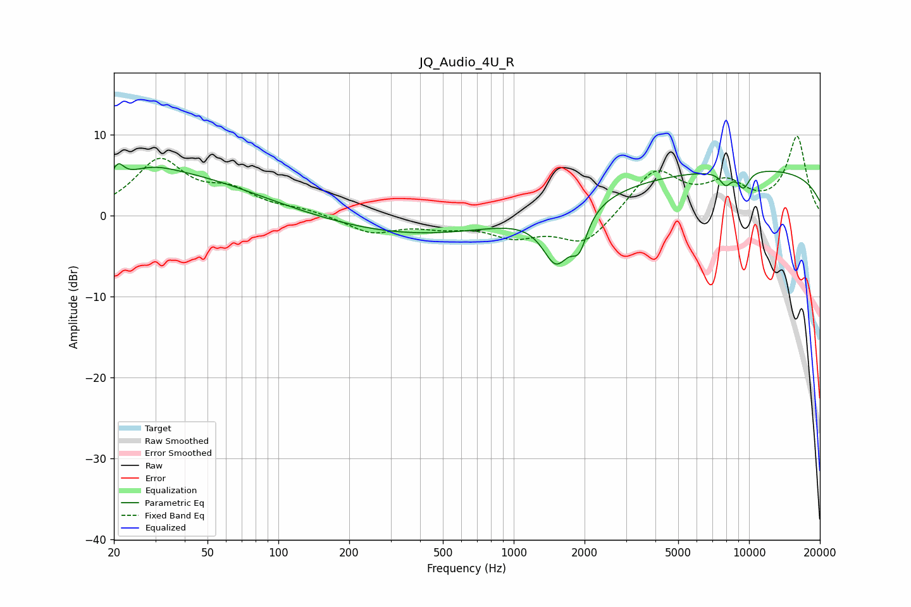

# JQ_Audio_4U_R
See [usage instructions](https://github.com/jaakkopasanen/AutoEq#usage) for more options and info.

### Parametric EQs
Apply preamp of -6.5 dB when using parametric equalizer.

|   # | Type    |   Fc (Hz) |    Q |   Gain (dB) |
|-----|---------|-----------|------|-------------|
|   1 | Peaking |        21 | 5.83 |         2   |
|   2 | Peaking |        28 | 1.32 |         1.5 |
|   3 | Peaking |        38 | 0.43 |         4.7 |
|   4 | Peaking |       390 | 0.38 |        -2.4 |
|   5 | Peaking |      1515 | 2.38 |        -6.4 |
|   6 | Peaking |      1898 | 4.21 |        -3.9 |
|   7 | Peaking |      7957 | 5.47 |        -1.6 |
|   8 | Peaking |      9385 | 5.33 |        -1.2 |
|   9 | Peaking |      9502 | 0.18 |         5.8 |
|  10 | Peaking |      9598 | 5.02 |        -0.9 |

### Fixed Band EQs
When using fixed band (also called graphic) equalizer, apply preamp of **-9.9 dB** (if available) and set gains manually with these parameters.

|   # | Type    |   Fc (Hz) |    Q |   Gain (dB) |
|-----|---------|-----------|------|-------------|
|   1 | Peaking |        31 | 1.41 |         6.6 |
|   2 | Peaking |        62 | 1.41 |         2.6 |
|   3 | Peaking |       125 | 1.41 |         0.6 |
|   4 | Peaking |       250 | 1.41 |        -2.1 |
|   5 | Peaking |       500 | 1.41 |        -1.1 |
|   6 | Peaking |      1000 | 1.41 |        -2.3 |
|   7 | Peaking |      2000 | 1.41 |        -3.6 |
|   8 | Peaking |      4000 | 1.41 |         5.6 |
|   9 | Peaking |      8000 | 1.41 |         3.4 |
|  10 | Peaking |     16000 | 1.41 |         9.7 |

### Graphs

