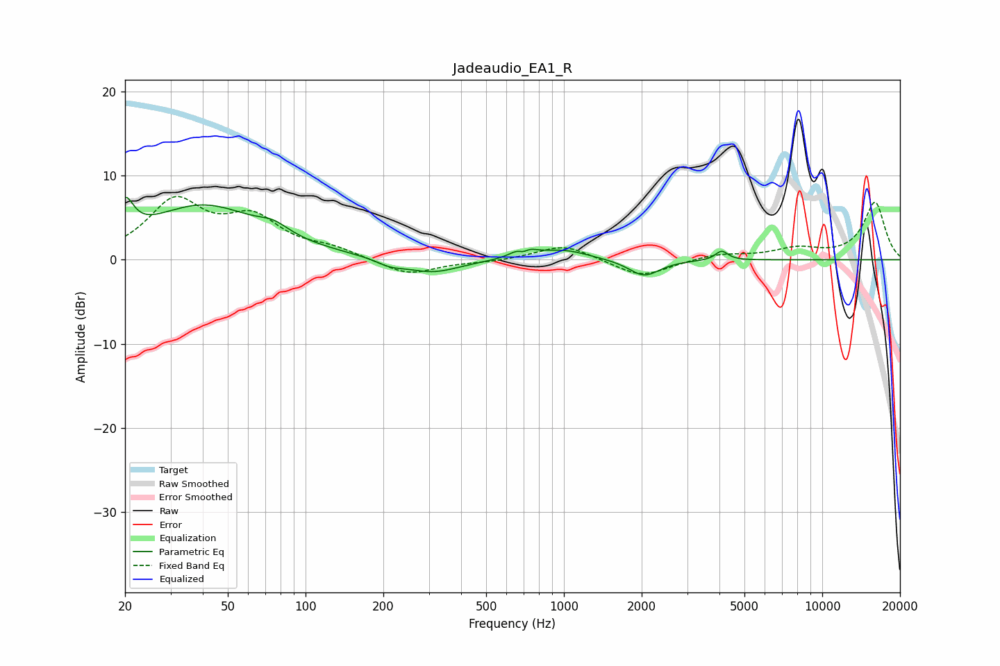

# Jadeaudio_EA1_R
See [usage instructions](https://github.com/jaakkopasanen/AutoEq#usage) for more options and info.

### Parametric EQs
Apply preamp of -7.5 dB when using parametric equalizer.

|   # | Type    |   Fc (Hz) |    Q |   Gain (dB) |
|-----|---------|-----------|------|-------------|
|   1 | Peaking |        20 | 4.48 |         4.1 |
|   2 | Peaking |        40 | 0.63 |         6.3 |
|   3 | Peaking |        75 | 2.43 |         1.1 |
|   4 | Peaking |       212 | 2.66 |        -0.7 |
|   5 | Peaking |       309 | 1.32 |        -1.7 |
|   6 | Peaking |       696 | 4.47 |         3   |
|   7 | Peaking |       697 | 5.96 |        -2.3 |
|   8 | Peaking |       996 | 1.45 |         1.2 |
|   9 | Peaking |      2046 | 2.38 |        -2   |
|  10 | Peaking |      4079 | 5.94 |         1.1 |

### Fixed Band EQs
When using fixed band (also called graphic) equalizer, apply preamp of **-7.6 dB** (if available) and set gains manually with these parameters.

|   # | Type    |   Fc (Hz) |    Q |   Gain (dB) |
|-----|---------|-----------|------|-------------|
|   1 | Peaking |        31 | 1.41 |         6.7 |
|   2 | Peaking |        62 | 1.41 |         4.4 |
|   3 | Peaking |       125 | 1.41 |         1.1 |
|   4 | Peaking |       250 | 1.41 |        -1.9 |
|   5 | Peaking |       500 | 1.41 |        -0.2 |
|   6 | Peaking |      1000 | 1.41 |         1.8 |
|   7 | Peaking |      2000 | 1.41 |        -2.1 |
|   8 | Peaking |      4000 | 1.41 |         0.7 |
|   9 | Peaking |      8000 | 1.41 |         1.2 |
|  10 | Peaking |     16000 | 1.41 |         6.8 |

### Graphs

