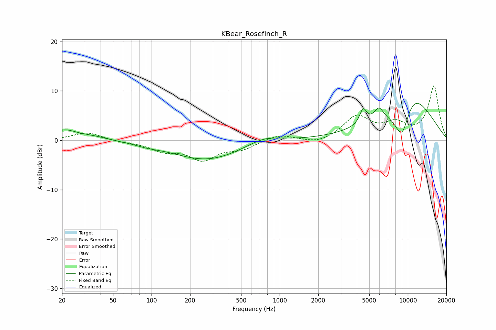

# KBear_Rosefinch_R
See [usage instructions](https://github.com/jaakkopasanen/AutoEq#usage) for more options and info.

### Parametric EQs
Apply preamp of -7.6 dB when using parametric equalizer.

|   # | Type    |   Fc (Hz) |    Q |   Gain (dB) |
|-----|---------|-----------|------|-------------|
|   1 | Peaking |        21 | 5.45 |        -0.1 |
|   2 | Peaking |        21 | 1.63 |         2   |
|   3 | Peaking |        34 | 1.14 |         0.8 |
|   4 | Peaking |        92 | 1.65 |        -0.4 |
|   5 | Peaking |       270 | 0.53 |        -4   |
|   6 | Peaking |       758 | 1.06 |         1.6 |
|   7 | Peaking |      4475 | 5.33 |         3   |
|   8 | Peaking |      5946 | 3.91 |         2.3 |
|   9 | Peaking |      9040 | 1.65 |       -11.3 |
|  10 | Peaking |     10000 | 0.69 |        13.6 |

### Fixed Band EQs
When using fixed band (also called graphic) equalizer, apply preamp of **-11.1 dB** (if available) and set gains manually with these parameters.

|   # | Type    |   Fc (Hz) |    Q |   Gain (dB) |
|-----|---------|-----------|------|-------------|
|   1 | Peaking |        31 | 1.41 |         1.6 |
|   2 | Peaking |        62 | 1.41 |        -0.3 |
|   3 | Peaking |       125 | 1.41 |        -1.9 |
|   4 | Peaking |       250 | 1.41 |        -3.7 |
|   5 | Peaking |       500 | 1.41 |        -1.6 |
|   6 | Peaking |      1000 | 1.41 |         1.2 |
|   7 | Peaking |      2000 | 1.41 |        -0.9 |
|   8 | Peaking |      4000 | 1.41 |         4.7 |
|   9 | Peaking |      8000 | 1.41 |         2.9 |
|  10 | Peaking |     16000 | 1.41 |        10.9 |

### Graphs

