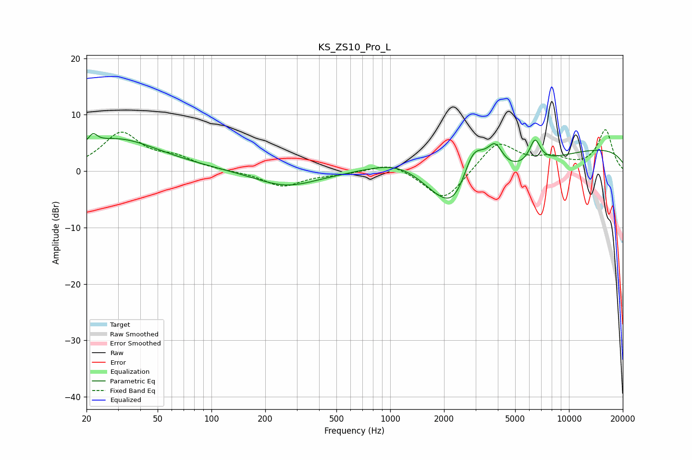

# KS_ZS10_Pro_L
See [usage instructions](https://github.com/jaakkopasanen/AutoEq#usage) for more options and info.

### Parametric EQs
Apply preamp of -6.7 dB when using parametric equalizer.

|   # | Type    |   Fc (Hz) |    Q |   Gain (dB) |
|-----|---------|-----------|------|-------------|
|   1 | Peaking |        22 | 6    |         1.6 |
|   2 | Peaking |        28 | 0.46 |         4.1 |
|   3 | Peaking |        31 | 0.87 |         1.7 |
|   4 | Peaking |       261 | 0.82 |        -2.7 |
|   5 | Peaking |      1196 | 0.67 |         6.6 |
|   6 | Peaking |      2361 | 0.69 |       -18.3 |
|   7 | Peaking |      2898 | 1.51 |        12.7 |
|   8 | Peaking |      3867 | 3.25 |         4.2 |
|   9 | Peaking |      6452 | 4.38 |         4.3 |
|  10 | Peaking |     10000 | 0.18 |         4.5 |

### Fixed Band EQs
When using fixed band (also called graphic) equalizer, apply preamp of **-7.4 dB** (if available) and set gains manually with these parameters.

|   # | Type    |   Fc (Hz) |    Q |   Gain (dB) |
|-----|---------|-----------|------|-------------|
|   1 | Peaking |        31 | 1.41 |         6.6 |
|   2 | Peaking |        62 | 1.41 |         1.9 |
|   3 | Peaking |       125 | 1.41 |        -0   |
|   4 | Peaking |       250 | 1.41 |        -2.7 |
|   5 | Peaking |       500 | 1.41 |        -0.5 |
|   6 | Peaking |      1000 | 1.41 |         1.7 |
|   7 | Peaking |      2000 | 1.41 |        -5.6 |
|   8 | Peaking |      4000 | 1.41 |         5.3 |
|   9 | Peaking |      8000 | 1.41 |         1.9 |
|  10 | Peaking |     16000 | 1.41 |         7.2 |

### Graphs

