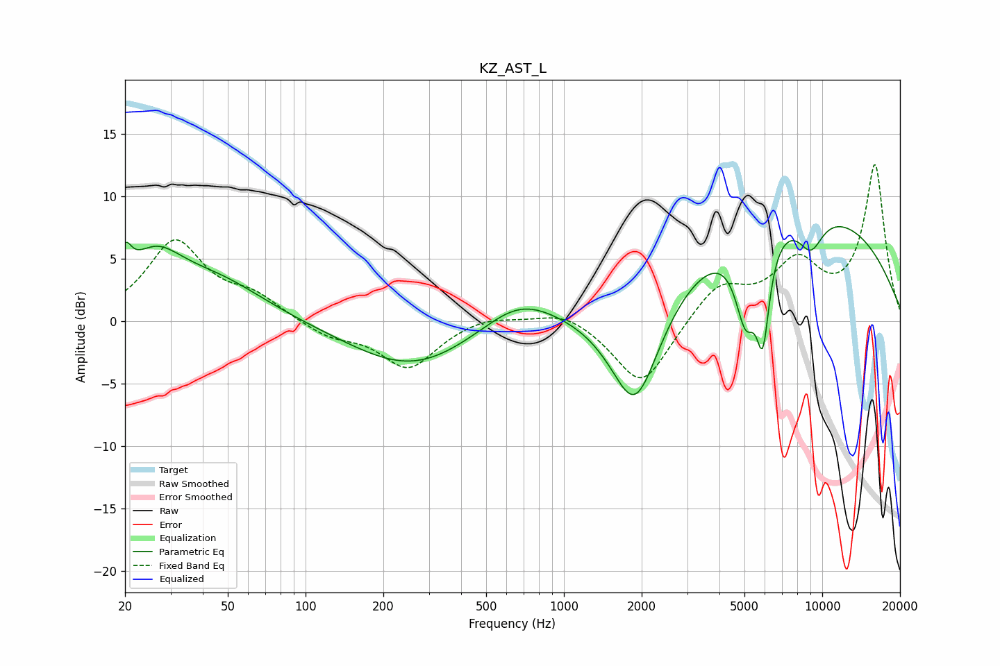

# KZ_AST_L
See [usage instructions](https://github.com/jaakkopasanen/AutoEq#usage) for more options and info.

### Parametric EQs
Apply preamp of -7.7 dB when using parametric equalizer.

|   # | Type    |   Fc (Hz) |    Q |   Gain (dB) |
|-----|---------|-----------|------|-------------|
|   1 | Peaking |        20 | 5.98 |         2.4 |
|   2 | Peaking |        26 | 1.27 |         4.3 |
|   3 | Peaking |        46 | 0.74 |         2.8 |
|   4 | Peaking |       259 | 0.59 |        -3.8 |
|   5 | Peaking |       670 | 0.99 |         2.4 |
|   6 | Peaking |      1889 | 1.37 |        -9.8 |
|   7 | Peaking |      5056 | 3.34 |        -6.3 |
|   8 | Peaking |      5891 | 5.33 |        -7.3 |
|   9 | Peaking |      7917 | 0.26 |         9.3 |
|  10 | Peaking |      9026 | 2.58 |        -2.8 |

### Fixed Band EQs
When using fixed band (also called graphic) equalizer, apply preamp of **-12.6 dB** (if available) and set gains manually with these parameters.

|   # | Type    |   Fc (Hz) |    Q |   Gain (dB) |
|-----|---------|-----------|------|-------------|
|   1 | Peaking |        31 | 1.41 |         6.3 |
|   2 | Peaking |        62 | 1.41 |         1.7 |
|   3 | Peaking |       125 | 1.41 |        -1.2 |
|   4 | Peaking |       250 | 1.41 |        -3.7 |
|   5 | Peaking |       500 | 1.41 |         0.6 |
|   6 | Peaking |      1000 | 1.41 |         1   |
|   7 | Peaking |      2000 | 1.41 |        -5.3 |
|   8 | Peaking |      4000 | 1.41 |         3   |
|   9 | Peaking |      8000 | 1.41 |         4.3 |
|  10 | Peaking |     16000 | 1.41 |        12.4 |

### Graphs

