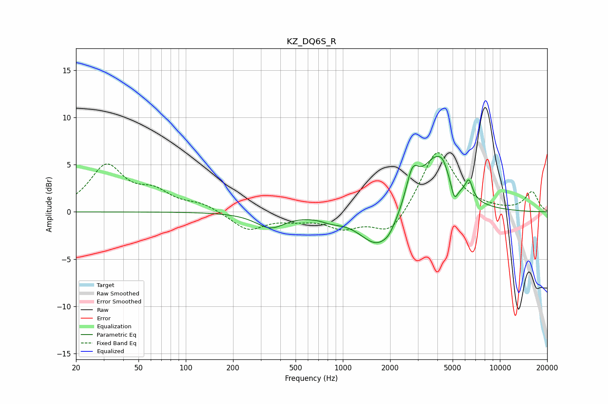

# KZ_DQ6S_R
See [usage instructions](https://github.com/jaakkopasanen/AutoEq#usage) for more options and info.

### Parametric EQs
Apply preamp of -6.0 dB when using parametric equalizer.

|   # | Type    |   Fc (Hz) |    Q |   Gain (dB) |
|-----|---------|-----------|------|-------------|
|   1 | Peaking |       343 | 1.56 |        -1.5 |
|   2 | Peaking |       389 | 1.86 |        -0.1 |
|   3 | Peaking |       844 | 2.1  |        -0.5 |
|   4 | Peaking |      1687 | 1.22 |        -4   |
|   5 | Peaking |      1968 | 4.11 |        -0.5 |
|   6 | Peaking |      2769 | 3.39 |         3.5 |
|   7 | Peaking |      3964 | 1.4  |         5.9 |
|   8 | Peaking |      4317 | 6    |         0.5 |
|   9 | Peaking |      5127 | 5.98 |        -2.1 |
|  10 | Peaking |      6349 | 6    |         1.9 |

### Fixed Band EQs
When using fixed band (also called graphic) equalizer, apply preamp of **-6.4 dB** (if available) and set gains manually with these parameters.

|   # | Type    |   Fc (Hz) |    Q |   Gain (dB) |
|-----|---------|-----------|------|-------------|
|   1 | Peaking |        31 | 1.41 |         4.7 |
|   2 | Peaking |        62 | 1.41 |         1.8 |
|   3 | Peaking |       125 | 1.41 |         0.8 |
|   4 | Peaking |       250 | 1.41 |        -1.9 |
|   5 | Peaking |       500 | 1.41 |        -0.6 |
|   6 | Peaking |      1000 | 1.41 |        -1.5 |
|   7 | Peaking |      2000 | 1.41 |        -2.6 |
|   8 | Peaking |      4000 | 1.41 |         6.7 |
|   9 | Peaking |      8000 | 1.41 |         0.2 |
|  10 | Peaking |     16000 | 1.41 |         2.1 |

### Graphs

