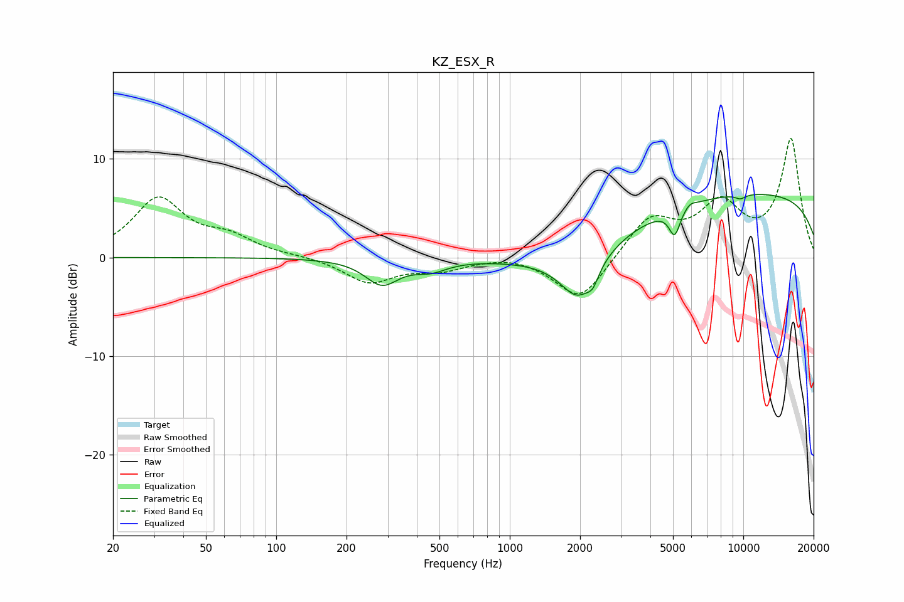

# KZ_ESX_R
See [usage instructions](https://github.com/jaakkopasanen/AutoEq#usage) for more options and info.

### Parametric EQs
Apply preamp of -6.5 dB when using parametric equalizer.

|   # | Type    |   Fc (Hz) |    Q |   Gain (dB) |
|-----|---------|-----------|------|-------------|
|   1 | Peaking |       284 | 1.99 |        -2.6 |
|   2 | Peaking |       458 | 1.98 |        -1   |
|   3 | Peaking |      1938 | 0.54 |        -1.9 |
|   4 | Peaking |      1969 | 1.82 |        -4.6 |
|   5 | Peaking |      2269 | 5.98 |        -1.2 |
|   6 | Peaking |      5082 | 5.88 |        -2.7 |
|   7 | Peaking |      5913 | 5.77 |         0.4 |
|   8 | Peaking |      9686 | 5.97 |        -0.4 |
|   9 | Peaking |     10000 | 4.78 |        -0.1 |
|  10 | Peaking |     10000 | 0.18 |         6.6 |

### Fixed Band EQs
When using fixed band (also called graphic) equalizer, apply preamp of **-12.1 dB** (if available) and set gains manually with these parameters.

|   # | Type    |   Fc (Hz) |    Q |   Gain (dB) |
|-----|---------|-----------|------|-------------|
|   1 | Peaking |        31 | 1.41 |         5.8 |
|   2 | Peaking |        62 | 1.41 |         1.7 |
|   3 | Peaking |       125 | 1.41 |         0.1 |
|   4 | Peaking |       250 | 1.41 |        -2.5 |
|   5 | Peaking |       500 | 1.41 |        -1.1 |
|   6 | Peaking |      1000 | 1.41 |         0.4 |
|   7 | Peaking |      2000 | 1.41 |        -4.5 |
|   8 | Peaking |      4000 | 1.41 |         4   |
|   9 | Peaking |      8000 | 1.41 |         4.9 |
|  10 | Peaking |     16000 | 1.41 |        11.9 |

### Graphs

