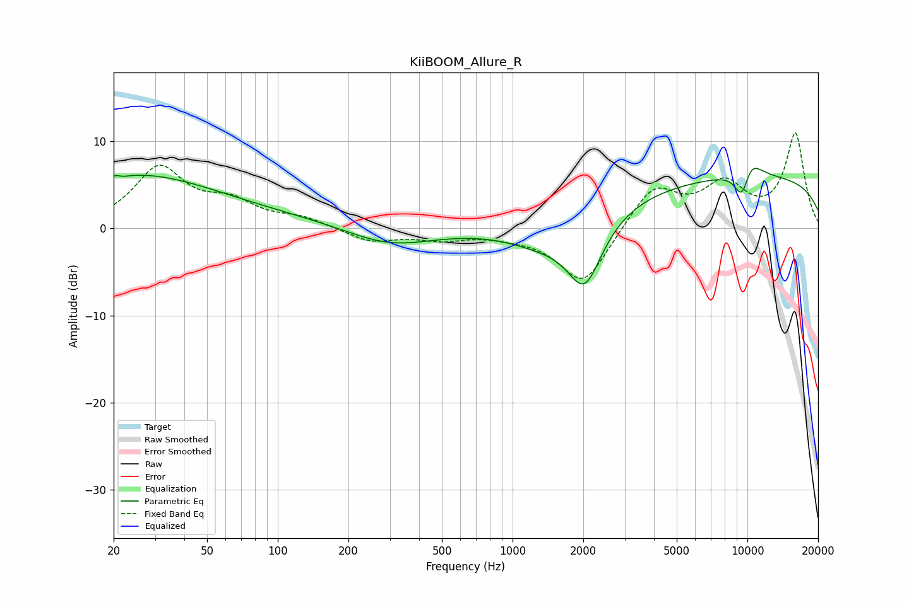

# KiiBOOM_Allure_R
See [usage instructions](https://github.com/jaakkopasanen/AutoEq#usage) for more options and info.

### Parametric EQs
Apply preamp of -7.0 dB when using parametric equalizer.

|   # | Type    |   Fc (Hz) |    Q |   Gain (dB) |
|-----|---------|-----------|------|-------------|
|   1 | Peaking |        21 | 5.84 |         3.2 |
|   2 | Peaking |        21 | 5.86 |        -3.2 |
|   3 | Peaking |        24 | 0.42 |         4.9 |
|   4 | Peaking |        47 | 0.22 |         1.4 |
|   5 | Peaking |       298 | 0.76 |        -2.2 |
|   6 | Peaking |      1346 | 0.9  |        -2.3 |
|   7 | Peaking |      2028 | 1.86 |        -7.6 |
|   8 | Peaking |      9517 | 3.53 |        -4.9 |
|   9 | Peaking |     10000 | 2.37 |         3.7 |
|  10 | Peaking |     10000 | 0.18 |         5.9 |

### Fixed Band EQs
When using fixed band (also called graphic) equalizer, apply preamp of **-11.0 dB** (if available) and set gains manually with these parameters.

|   # | Type    |   Fc (Hz) |    Q |   Gain (dB) |
|-----|---------|-----------|------|-------------|
|   1 | Peaking |        31 | 1.41 |         6.7 |
|   2 | Peaking |        62 | 1.41 |         2.5 |
|   3 | Peaking |       125 | 1.41 |         1.1 |
|   4 | Peaking |       250 | 1.41 |        -1.5 |
|   5 | Peaking |       500 | 1.41 |        -1.1 |
|   6 | Peaking |      1000 | 1.41 |        -0.5 |
|   7 | Peaking |      2000 | 1.41 |        -6.6 |
|   8 | Peaking |      4000 | 1.41 |         4.9 |
|   9 | Peaking |      8000 | 1.41 |         4.6 |
|  10 | Peaking |     16000 | 1.41 |        10.7 |

### Graphs

