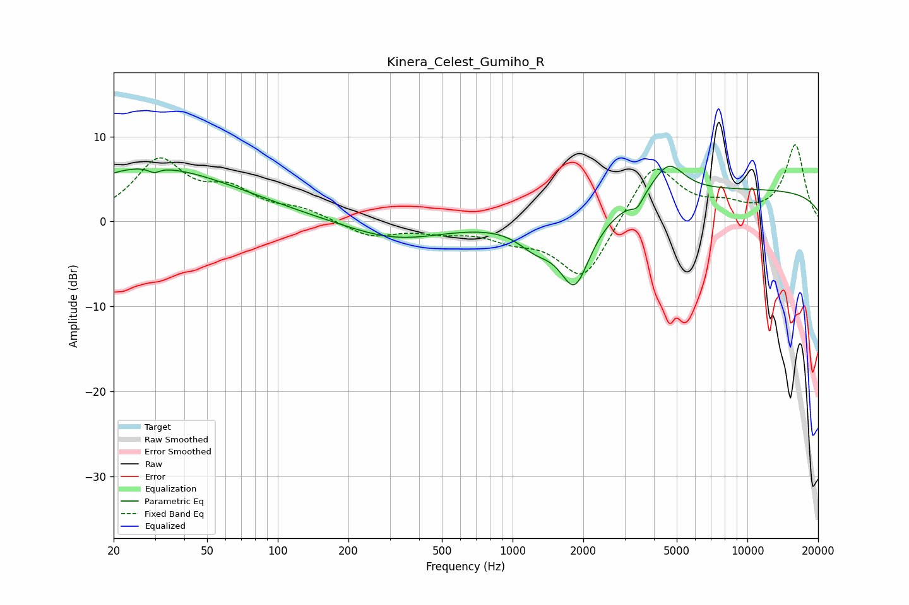

# Kinera_Celest_Gumiho_R
See [usage instructions](https://github.com/jaakkopasanen/AutoEq#usage) for more options and info.

### Parametric EQs
Apply preamp of -6.6 dB when using parametric equalizer.

|   # | Type    |   Fc (Hz) |    Q |   Gain (dB) |
|-----|---------|-----------|------|-------------|
|   1 | Peaking |        23 | 0.71 |         1.6 |
|   2 | Peaking |        30 | 5.66 |        -3.6 |
|   3 | Peaking |        30 | 5.66 |         3   |
|   4 | Peaking |        35 | 0.4  |         5.1 |
|   5 | Peaking |       318 | 0.68 |        -2.2 |
|   6 | Peaking |      1254 | 1.79 |        -2.4 |
|   7 | Peaking |      1840 | 2.09 |        -8.2 |
|   8 | Peaking |      3389 | 5.47 |        -1.3 |
|   9 | Peaking |      4598 | 2.06 |         3.9 |
|  10 | Peaking |     10000 | 0.18 |         3.7 |

### Fixed Band EQs
When using fixed band (also called graphic) equalizer, apply preamp of **-9.1 dB** (if available) and set gains manually with these parameters.

|   # | Type    |   Fc (Hz) |    Q |   Gain (dB) |
|-----|---------|-----------|------|-------------|
|   1 | Peaking |        31 | 1.41 |         6.9 |
|   2 | Peaking |        62 | 1.41 |         3.1 |
|   3 | Peaking |       125 | 1.41 |         1.2 |
|   4 | Peaking |       250 | 1.41 |        -1.8 |
|   5 | Peaking |       500 | 1.41 |        -0.9 |
|   6 | Peaking |      1000 | 1.41 |        -1.6 |
|   7 | Peaking |      2000 | 1.41 |        -7.1 |
|   8 | Peaking |      4000 | 1.41 |         7.1 |
|   9 | Peaking |      8000 | 1.41 |         1.4 |
|  10 | Peaking |     16000 | 1.41 |         9   |

### Graphs

