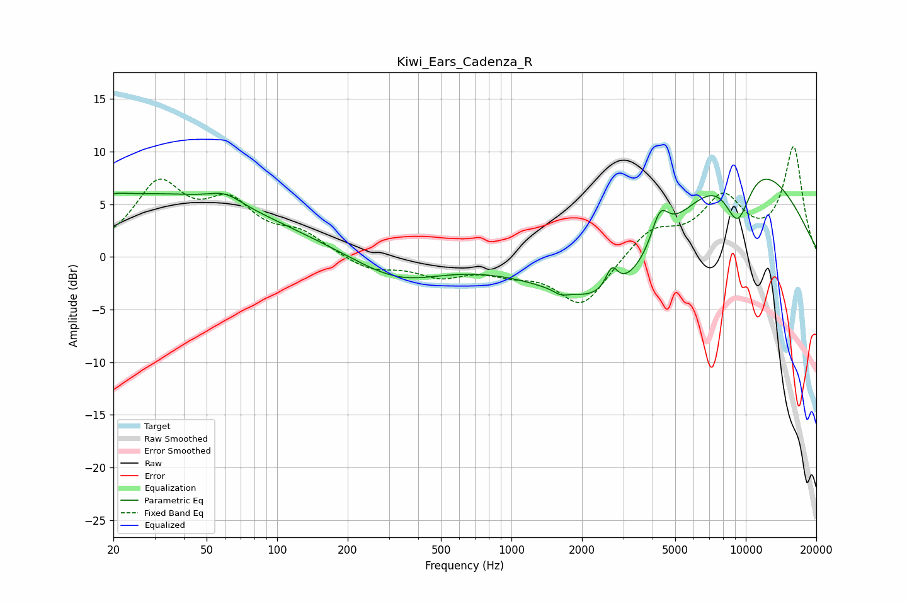

# Kiwi_Ears_Cadenza_R
See [usage instructions](https://github.com/jaakkopasanen/AutoEq#usage) for more options and info.

### Parametric EQs
Apply preamp of -7.5 dB when using parametric equalizer.

|   # | Type    |   Fc (Hz) |    Q |   Gain (dB) |
|-----|---------|-----------|------|-------------|
|   1 | Peaking |        20 | 2.53 |         0.4 |
|   2 | Peaking |        30 | 0.26 |         5.9 |
|   3 | Peaking |        60 | 2.04 |         1   |
|   4 | Peaking |       327 | 0.77 |        -2.3 |
|   5 | Peaking |      1623 | 5.23 |        -0.4 |
|   6 | Peaking |      2681 | 5.42 |         2.2 |
|   7 | Peaking |      2782 | 0.56 |        -6.9 |
|   8 | Peaking |      4303 | 3.69 |         3.3 |
|   9 | Peaking |      9116 | 0.41 |        10.9 |
|  10 | Peaking |      9231 | 2.11 |        -5.9 |

### Fixed Band EQs
When using fixed band (also called graphic) equalizer, apply preamp of **-10.5 dB** (if available) and set gains manually with these parameters.

|   # | Type    |   Fc (Hz) |    Q |   Gain (dB) |
|-----|---------|-----------|------|-------------|
|   1 | Peaking |        31 | 1.41 |         6.5 |
|   2 | Peaking |        62 | 1.41 |         4.4 |
|   3 | Peaking |       125 | 1.41 |         1.9 |
|   4 | Peaking |       250 | 1.41 |        -1.3 |
|   5 | Peaking |       500 | 1.41 |        -1.6 |
|   6 | Peaking |      1000 | 1.41 |        -1.1 |
|   7 | Peaking |      2000 | 1.41 |        -4.7 |
|   8 | Peaking |      4000 | 1.41 |         2.6 |
|   9 | Peaking |      8000 | 1.41 |         5.2 |
|  10 | Peaking |     16000 | 1.41 |        10.3 |

### Graphs

