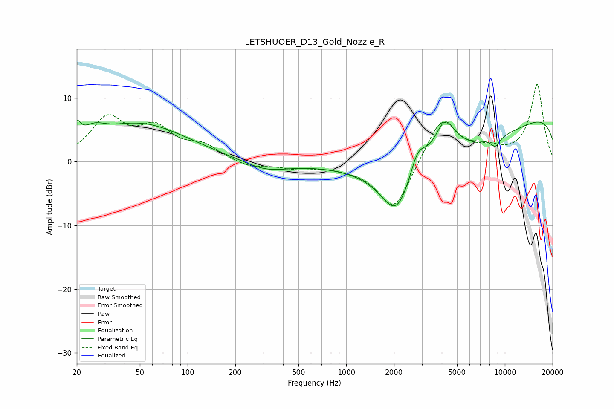

# LETSHUOER_D13_Gold_Nozzle_R
See [usage instructions](https://github.com/jaakkopasanen/AutoEq#usage) for more options and info.

### Parametric EQs
Apply preamp of -6.6 dB when using parametric equalizer.

|   # | Type    |   Fc (Hz) |    Q |   Gain (dB) |
|-----|---------|-----------|------|-------------|
|   1 | Peaking |        20 | 5.99 |         2.6 |
|   2 | Peaking |        26 | 2.01 |         1.8 |
|   3 | Peaking |        50 | 0.47 |         5.9 |
|   4 | Peaking |       312 | 1    |        -1.6 |
|   5 | Peaking |      2080 | 1.41 |        -7.9 |
|   6 | Peaking |      2821 | 2.8  |         4.1 |
|   7 | Peaking |      4184 | 2.18 |         5.8 |
|   8 | Peaking |      5525 | 0.24 |        -7.9 |
|   9 | Peaking |      8712 | 4.36 |        -1.5 |
|  10 | Peaking |     10000 | 0.18 |        11.1 |

### Fixed Band EQs
When using fixed band (also called graphic) equalizer, apply preamp of **-12.2 dB** (if available) and set gains manually with these parameters.

|   # | Type    |   Fc (Hz) |    Q |   Gain (dB) |
|-----|---------|-----------|------|-------------|
|   1 | Peaking |        31 | 1.41 |         6.4 |
|   2 | Peaking |        62 | 1.41 |         4.6 |
|   3 | Peaking |       125 | 1.41 |         2.2 |
|   4 | Peaking |       250 | 1.41 |        -1   |
|   5 | Peaking |       500 | 1.41 |        -0.9 |
|   6 | Peaking |      1000 | 1.41 |        -0.5 |
|   7 | Peaking |      2000 | 1.41 |        -7.9 |
|   8 | Peaking |      4000 | 1.41 |         7.2 |
|   9 | Peaking |      8000 | 1.41 |         1.4 |
|  10 | Peaking |     16000 | 1.41 |        12.1 |

### Graphs

