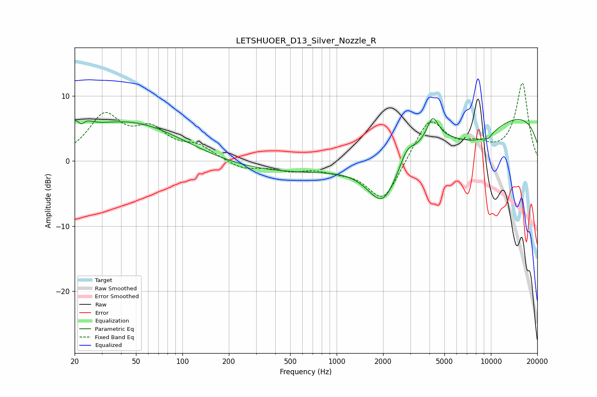

# LETSHUOER_D13_Silver_Nozzle_R
See [usage instructions](https://github.com/jaakkopasanen/AutoEq#usage) for more options and info.

### Parametric EQs
Apply preamp of -6.6 dB when using parametric equalizer.

|   # | Type    |   Fc (Hz) |    Q |   Gain (dB) |
|-----|---------|-----------|------|-------------|
|   1 | Peaking |        22 | 3.19 |         5   |
|   2 | Peaking |        22 | 5.14 |        -3.5 |
|   3 | Peaking |        45 | 0.39 |         6.1 |
|   4 | Peaking |       695 | 0.18 |        -2.1 |
|   5 | Peaking |      1994 | 1.35 |        -7.9 |
|   6 | Peaking |      2855 | 3.38 |         1.9 |
|   7 | Peaking |      4197 | 3.73 |         3.6 |
|   8 | Peaking |      7958 | 0.72 |        -4.4 |
|   9 | Peaking |      9616 | 5.51 |        -0.6 |
|  10 | Peaking |      9871 | 0.18 |         8.3 |

### Fixed Band EQs
When using fixed band (also called graphic) equalizer, apply preamp of **-12.1 dB** (if available) and set gains manually with these parameters.

|   # | Type    |   Fc (Hz) |    Q |   Gain (dB) |
|-----|---------|-----------|------|-------------|
|   1 | Peaking |        31 | 1.41 |         6.6 |
|   2 | Peaking |        62 | 1.41 |         4.1 |
|   3 | Peaking |       125 | 1.41 |         2   |
|   4 | Peaking |       250 | 1.41 |        -1.3 |
|   5 | Peaking |       500 | 1.41 |        -1.2 |
|   6 | Peaking |      1000 | 1.41 |        -1   |
|   7 | Peaking |      2000 | 1.41 |        -6.4 |
|   8 | Peaking |      4000 | 1.41 |         6.7 |
|   9 | Peaking |      8000 | 1.41 |         1.9 |
|  10 | Peaking |     16000 | 1.41 |        11.9 |

### Graphs

