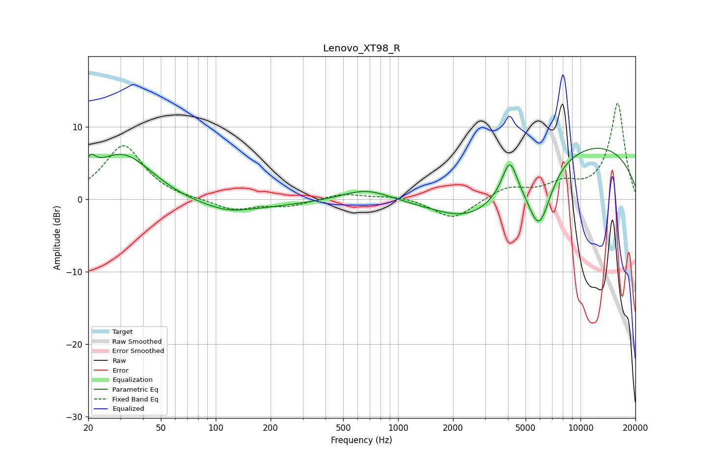

# Lenovo_XT98_R
See [usage instructions](https://github.com/jaakkopasanen/AutoEq#usage) for more options and info.

### Parametric EQs
Apply preamp of -7.1 dB when using parametric equalizer.

|   # | Type    |   Fc (Hz) |    Q |   Gain (dB) |
|-----|---------|-----------|------|-------------|
|   1 | Peaking |        21 | 5.34 |         1.9 |
|   2 | Peaking |        31 | 0.76 |         7.8 |
|   3 | Peaking |        69 | 0.3  |        -2.1 |
|   4 | Peaking |       118 | 1.4  |        -0.6 |
|   5 | Peaking |       668 | 1.09 |         1.7 |
|   6 | Peaking |      2565 | 0.66 |        -5.6 |
|   7 | Peaking |      4090 | 3.45 |         5   |
|   8 | Peaking |      5932 | 2.01 |        -8.9 |
|   9 | Peaking |      9677 | 0.24 |         8.1 |
|  10 | Peaking |     10000 | 4.54 |        -0.1 |

### Fixed Band EQs
When using fixed band (also called graphic) equalizer, apply preamp of **-13.3 dB** (if available) and set gains manually with these parameters.

|   # | Type    |   Fc (Hz) |    Q |   Gain (dB) |
|-----|---------|-----------|------|-------------|
|   1 | Peaking |        31 | 1.41 |         7.5 |
|   2 | Peaking |        62 | 1.41 |        -0.1 |
|   3 | Peaking |       125 | 1.41 |        -1.5 |
|   4 | Peaking |       250 | 1.41 |        -0.9 |
|   5 | Peaking |       500 | 1.41 |         0.8 |
|   6 | Peaking |      1000 | 1.41 |         0.5 |
|   7 | Peaking |      2000 | 1.41 |        -2.8 |
|   8 | Peaking |      4000 | 1.41 |         1.6 |
|   9 | Peaking |      8000 | 1.41 |         1.8 |
|  10 | Peaking |     16000 | 1.41 |        13.3 |

### Graphs

