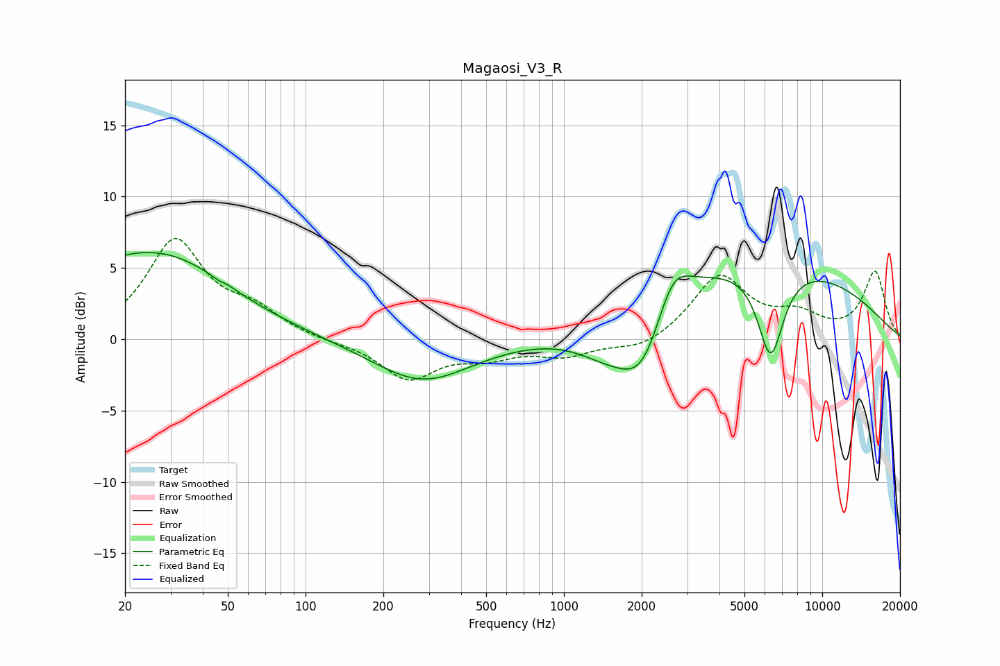

# Magaosi_V3_R
See [usage instructions](https://github.com/jaakkopasanen/AutoEq#usage) for more options and info.

### Parametric EQs
Apply preamp of -6.2 dB when using parametric equalizer.

|   # | Type    |   Fc (Hz) |    Q |   Gain (dB) |
|-----|---------|-----------|------|-------------|
|   1 | Peaking |        21 | 0.42 |         4.9 |
|   2 | Peaking |        32 | 0.69 |         1.5 |
|   3 | Peaking |        48 | 5.87 |        -2.7 |
|   4 | Peaking |        48 | 5.94 |         2.7 |
|   5 | Peaking |       282 | 0.74 |        -3   |
|   6 | Peaking |      1503 | 1.04 |        -2.4 |
|   7 | Peaking |      2028 | 1.55 |        -4.4 |
|   8 | Peaking |      2633 | 2.12 |         3.1 |
|   9 | Peaking |      5575 | 0.28 |         5.6 |
|  10 | Peaking |      6312 | 2.71 |        -6.4 |

### Fixed Band EQs
When using fixed band (also called graphic) equalizer, apply preamp of **-7.2 dB** (if available) and set gains manually with these parameters.

|   # | Type    |   Fc (Hz) |    Q |   Gain (dB) |
|-----|---------|-----------|------|-------------|
|   1 | Peaking |        31 | 1.41 |         6.8 |
|   2 | Peaking |        62 | 1.41 |         1.7 |
|   3 | Peaking |       125 | 1.41 |        -0.2 |
|   4 | Peaking |       250 | 1.41 |        -2.7 |
|   5 | Peaking |       500 | 1.41 |        -1   |
|   6 | Peaking |      1000 | 1.41 |        -1   |
|   7 | Peaking |      2000 | 1.41 |        -0.8 |
|   8 | Peaking |      4000 | 1.41 |         4.4 |
|   9 | Peaking |      8000 | 1.41 |         1.4 |
|  10 | Peaking |     16000 | 1.41 |         4.7 |

### Graphs

