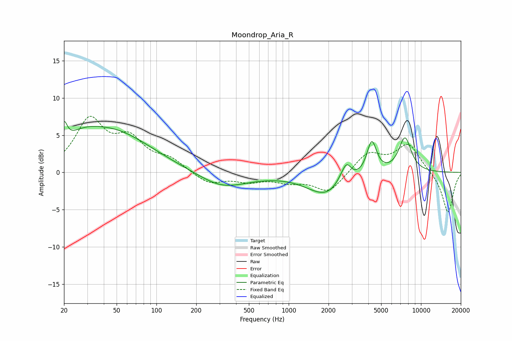

# Moondrop_Aria_R
See [usage instructions](https://github.com/jaakkopasanen/AutoEq#usage) for more options and info.

### Parametric EQs
Apply preamp of -6.9 dB when using parametric equalizer.

|   # | Type    |   Fc (Hz) |    Q |   Gain (dB) |
|-----|---------|-----------|------|-------------|
|   1 | Peaking |        20 | 6    |         2.7 |
|   2 | Peaking |        27 | 1.07 |         1.8 |
|   3 | Peaking |        47 | 0.48 |         5.2 |
|   4 | Peaking |       305 | 0.84 |        -1.7 |
|   5 | Peaking |       400 | 0.68 |        -0.5 |
|   6 | Peaking |      1964 | 0.95 |        -3.2 |
|   7 | Peaking |      2591 | 2.67 |         1.5 |
|   8 | Peaking |      2753 | 4.43 |         1.5 |
|   9 | Peaking |      4244 | 3.8  |         4.5 |
|  10 | Peaking |      7562 | 2.77 |         4.7 |

### Fixed Band EQs
When using fixed band (also called graphic) equalizer, apply preamp of **-7.6 dB** (if available) and set gains manually with these parameters.

|   # | Type    |   Fc (Hz) |    Q |   Gain (dB) |
|-----|---------|-----------|------|-------------|
|   1 | Peaking |        31 | 1.41 |         6.8 |
|   2 | Peaking |        62 | 1.41 |         3.9 |
|   3 | Peaking |       125 | 1.41 |         1.5 |
|   4 | Peaking |       250 | 1.41 |        -1.5 |
|   5 | Peaking |       500 | 1.41 |        -1   |
|   6 | Peaking |      1000 | 1.41 |        -1   |
|   7 | Peaking |      2000 | 1.41 |        -2.7 |
|   8 | Peaking |      4000 | 1.41 |         2.6 |
|   9 | Peaking |      8000 | 1.41 |         3.7 |
|  10 | Peaking |     16000 | 1.41 |        -5.5 |

### Graphs

