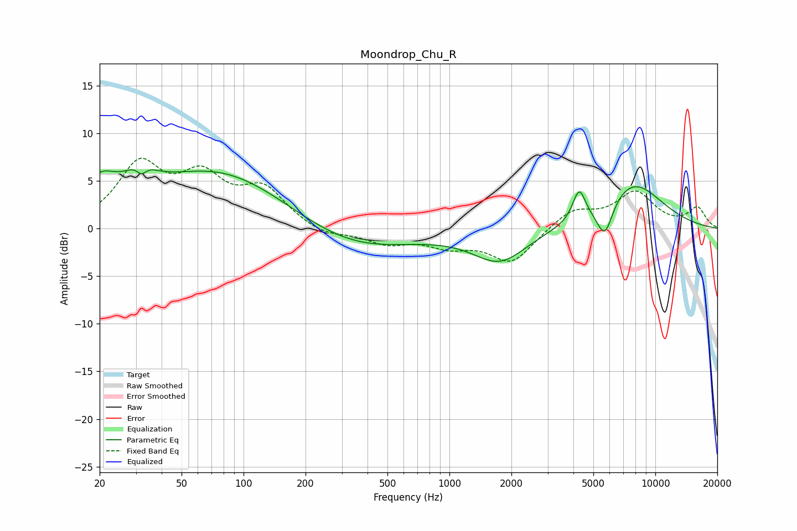

# Moondrop_Chu_R
See [usage instructions](https://github.com/jaakkopasanen/AutoEq#usage) for more options and info.

### Parametric EQs
Apply preamp of -6.3 dB when using parametric equalizer.

|   # | Type    |   Fc (Hz) |    Q |   Gain (dB) |
|-----|---------|-----------|------|-------------|
|   1 | Peaking |        20 | 1.77 |         3.3 |
|   2 | Peaking |        31 | 1.99 |         2.2 |
|   3 | Peaking |        32 | 5.97 |        -1.1 |
|   4 | Peaking |        76 | 0.4  |         6.3 |
|   5 | Peaking |       322 | 0.48 |        -2.8 |
|   6 | Peaking |      1759 | 1.07 |        -3.4 |
|   7 | Peaking |      4129 | 4.84 |         0.6 |
|   8 | Peaking |      4289 | 4.74 |         2.7 |
|   9 | Peaking |      5681 | 3.5  |        -3.8 |
|  10 | Peaking |      7686 | 0.86 |         4.9 |

### Fixed Band EQs
When using fixed band (also called graphic) equalizer, apply preamp of **-7.5 dB** (if available) and set gains manually with these parameters.

|   # | Type    |   Fc (Hz) |    Q |   Gain (dB) |
|-----|---------|-----------|------|-------------|
|   1 | Peaking |        31 | 1.41 |         6.3 |
|   2 | Peaking |        62 | 1.41 |         4.7 |
|   3 | Peaking |       125 | 1.41 |         3.8 |
|   4 | Peaking |       250 | 1.41 |        -0.9 |
|   5 | Peaking |       500 | 1.41 |        -1.4 |
|   6 | Peaking |      1000 | 1.41 |        -1.6 |
|   7 | Peaking |      2000 | 1.41 |        -3.5 |
|   8 | Peaking |      4000 | 1.41 |         2   |
|   9 | Peaking |      8000 | 1.41 |         3.7 |
|  10 | Peaking |     16000 | 1.41 |         2.1 |

### Graphs

