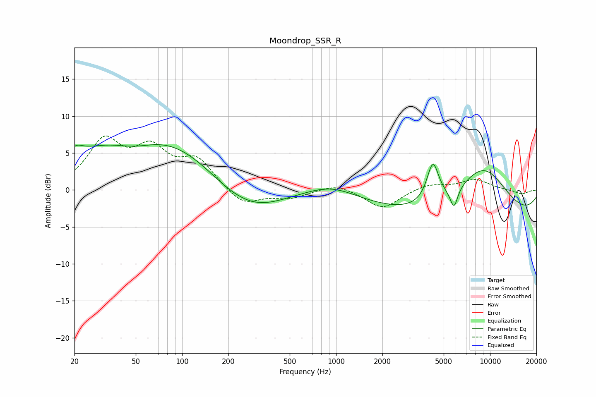

# Moondrop_SSR_R
See [usage instructions](https://github.com/jaakkopasanen/AutoEq#usage) for more options and info.

### Parametric EQs
Apply preamp of -6.2 dB when using parametric equalizer.

|   # | Type    |   Fc (Hz) |    Q |   Gain (dB) |
|-----|---------|-----------|------|-------------|
|   1 | Peaking |        20 | 3.46 |         1   |
|   2 | Peaking |        49 | 0.97 |        -1.9 |
|   3 | Peaking |        64 | 0.26 |         8.6 |
|   4 | Peaking |       199 | 0.65 |        -2.9 |
|   5 | Peaking |       303 | 0.68 |        -3.1 |
|   6 | Peaking |       936 | 0.88 |         1.5 |
|   7 | Peaking |      4253 | 3.59 |         5.4 |
|   8 | Peaking |      5829 | 5.58 |        -2.7 |
|   9 | Peaking |      8324 | 0.18 |        -4.8 |
|  10 | Peaking |      9015 | 0.71 |         7.4 |

### Fixed Band EQs
When using fixed band (also called graphic) equalizer, apply preamp of **-7.4 dB** (if available) and set gains manually with these parameters.

|   # | Type    |   Fc (Hz) |    Q |   Gain (dB) |
|-----|---------|-----------|------|-------------|
|   1 | Peaking |        31 | 1.41 |         6.3 |
|   2 | Peaking |        62 | 1.41 |         4.8 |
|   3 | Peaking |       125 | 1.41 |         3.8 |
|   4 | Peaking |       250 | 1.41 |        -2.2 |
|   5 | Peaking |       500 | 1.41 |        -1   |
|   6 | Peaking |      1000 | 1.41 |         0.9 |
|   7 | Peaking |      2000 | 1.41 |        -2.6 |
|   8 | Peaking |      4000 | 1.41 |         0.8 |
|   9 | Peaking |      8000 | 1.41 |         1.4 |
|  10 | Peaking |     16000 | 1.41 |        -0.6 |

### Graphs

