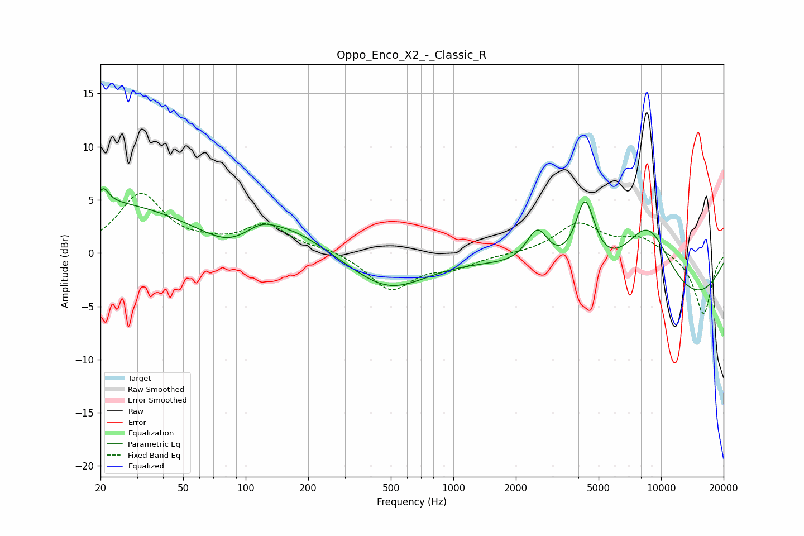

# Oppo_Enco_X2_-_Classic_R
See [usage instructions](https://github.com/jaakkopasanen/AutoEq#usage) for more options and info.

### Parametric EQs
Apply preamp of -6.2 dB when using parametric equalizer.

|   # | Type    |   Fc (Hz) |    Q |   Gain (dB) |
|-----|---------|-----------|------|-------------|
|   1 | Peaking |        20 | 0.34 |         4.8 |
|   2 | Peaking |        21 | 5.85 |         1.3 |
|   3 | Peaking |        82 | 1.19 |        -1.3 |
|   4 | Peaking |       119 | 1.81 |         1.2 |
|   5 | Peaking |       167 | 0.87 |         2   |
|   6 | Peaking |       489 | 0.78 |        -3.3 |
|   7 | Peaking |      2539 | 2.69 |         3.4 |
|   8 | Peaking |      4309 | 2.9  |         6.7 |
|   9 | Peaking |      8632 | 0.96 |         8.2 |
|  10 | Peaking |      9914 | 0.3  |        -6.5 |

### Fixed Band EQs
When using fixed band (also called graphic) equalizer, apply preamp of **-5.7 dB** (if available) and set gains manually with these parameters.

|   # | Type    |   Fc (Hz) |    Q |   Gain (dB) |
|-----|---------|-----------|------|-------------|
|   1 | Peaking |        31 | 1.41 |         5.4 |
|   2 | Peaking |        62 | 1.41 |         0.5 |
|   3 | Peaking |       125 | 1.41 |         2.5 |
|   4 | Peaking |       250 | 1.41 |         0.4 |
|   5 | Peaking |       500 | 1.41 |        -3.4 |
|   6 | Peaking |      1000 | 1.41 |        -1.1 |
|   7 | Peaking |      2000 | 1.41 |        -0.1 |
|   8 | Peaking |      4000 | 1.41 |         2.8 |
|   9 | Peaking |      8000 | 1.41 |         1.4 |
|  10 | Peaking |     16000 | 1.41 |        -5.8 |

### Graphs

