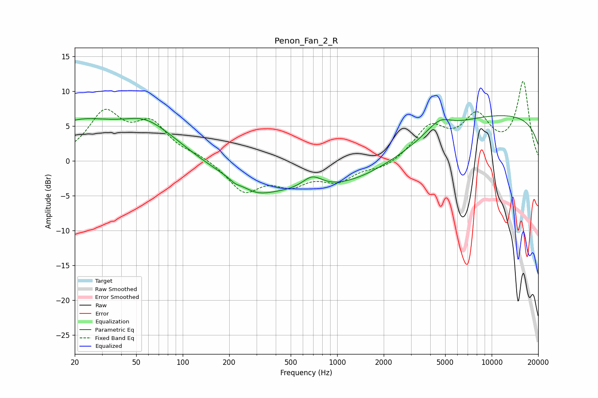

# Penon_Fan_2_R
See [usage instructions](https://github.com/jaakkopasanen/AutoEq#usage) for more options and info.

### Parametric EQs
Apply preamp of -6.6 dB when using parametric equalizer.

|   # | Type    |   Fc (Hz) |    Q |   Gain (dB) |
|-----|---------|-----------|------|-------------|
|   1 | Peaking |        20 | 0.6  |         4.7 |
|   2 | Peaking |        56 | 1.46 |         0.7 |
|   3 | Peaking |        62 | 0.62 |         4.4 |
|   4 | Peaking |       218 | 4.7  |        -0.4 |
|   5 | Peaking |       300 | 1.49 |        -1.2 |
|   6 | Peaking |       689 | 2.14 |         1.9 |
|   7 | Peaking |       741 | 0.21 |        -4.9 |
|   8 | Peaking |      4675 | 1.52 |         3.1 |
|   9 | Peaking |      5076 | 1.25 |        -1.4 |
|  10 | Peaking |     10000 | 0.18 |         6.8 |

### Fixed Band EQs
When using fixed band (also called graphic) equalizer, apply preamp of **-11.5 dB** (if available) and set gains manually with these parameters.

|   # | Type    |   Fc (Hz) |    Q |   Gain (dB) |
|-----|---------|-----------|------|-------------|
|   1 | Peaking |        31 | 1.41 |         6.5 |
|   2 | Peaking |        62 | 1.41 |         4.8 |
|   3 | Peaking |       125 | 1.41 |         0.6 |
|   4 | Peaking |       250 | 1.41 |        -4.3 |
|   5 | Peaking |       500 | 1.41 |        -2.8 |
|   6 | Peaking |      1000 | 1.41 |        -2.6 |
|   7 | Peaking |      2000 | 1.41 |        -1.1 |
|   8 | Peaking |      4000 | 1.41 |         4.6 |
|   9 | Peaking |      8000 | 1.41 |         5.8 |
|  10 | Peaking |     16000 | 1.41 |        11.1 |

### Graphs

