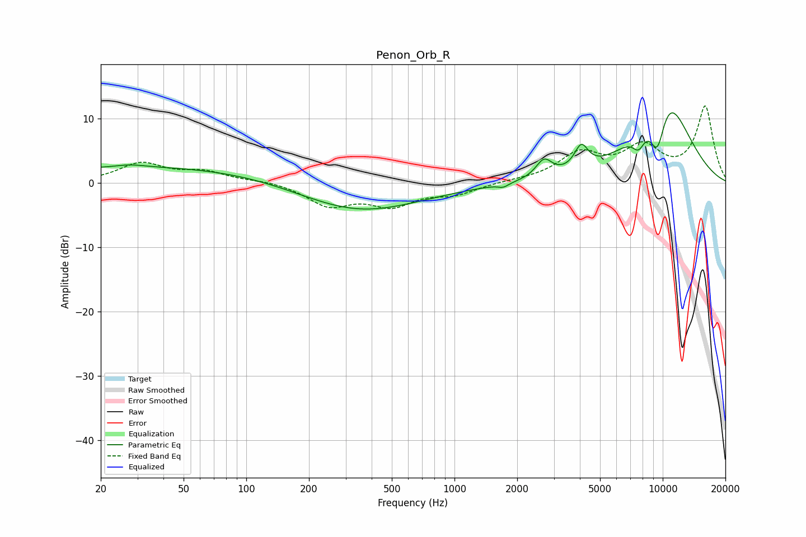

# Penon_Orb_R
See [usage instructions](https://github.com/jaakkopasanen/AutoEq#usage) for more options and info.

### Parametric EQs
Apply preamp of -11.0 dB when using parametric equalizer.

|   # | Type    |   Fc (Hz) |    Q |   Gain (dB) |
|-----|---------|-----------|------|-------------|
|   1 | Peaking |        28 | 2.23 |         0.4 |
|   2 | Peaking |        42 | 0.18 |         2.6 |
|   3 | Peaking |       337 | 0.47 |        -4.9 |
|   4 | Peaking |      1717 | 5.59 |        -0.6 |
|   5 | Peaking |      2691 | 3.62 |         2.8 |
|   6 | Peaking |      4063 | 4.23 |         3.7 |
|   7 | Peaking |      7661 | 4.36 |        -2.7 |
|   8 | Peaking |      9439 | 2.88 |        -9.3 |
|   9 | Peaking |     10000 | 0.88 |         8.9 |
|  10 | Peaking |     10000 | 1.07 |         6.8 |

### Fixed Band EQs
When using fixed band (also called graphic) equalizer, apply preamp of **-12.0 dB** (if available) and set gains manually with these parameters.

|   # | Type    |   Fc (Hz) |    Q |   Gain (dB) |
|-----|---------|-----------|------|-------------|
|   1 | Peaking |        31 | 1.41 |         2.9 |
|   2 | Peaking |        62 | 1.41 |         1.5 |
|   3 | Peaking |       125 | 1.41 |         0.4 |
|   4 | Peaking |       250 | 1.41 |        -3.4 |
|   5 | Peaking |       500 | 1.41 |        -3.2 |
|   6 | Peaking |      1000 | 1.41 |        -1.6 |
|   7 | Peaking |      2000 | 1.41 |         0.2 |
|   8 | Peaking |      4000 | 1.41 |         4.3 |
|   9 | Peaking |      8000 | 1.41 |         5   |
|  10 | Peaking |     16000 | 1.41 |        11.7 |

### Graphs

