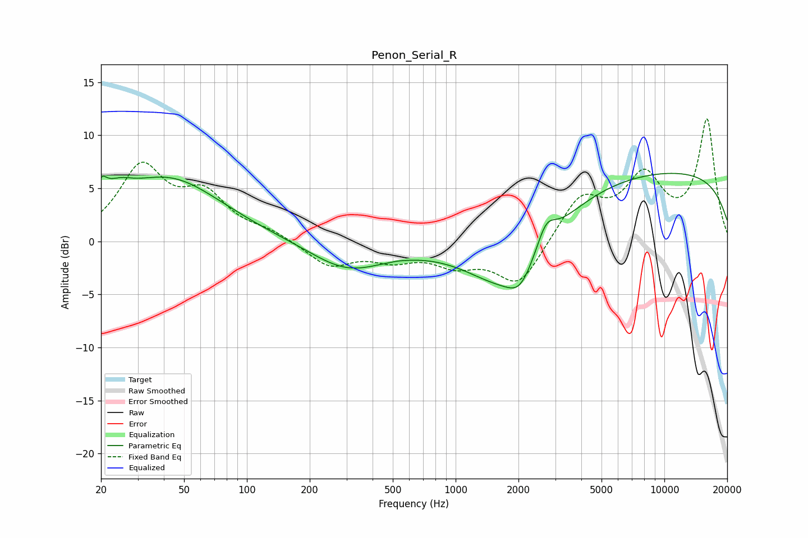

# Penon_Serial_R
See [usage instructions](https://github.com/jaakkopasanen/AutoEq#usage) for more options and info.

### Parametric EQs
Apply preamp of -6.5 dB when using parametric equalizer.

|   # | Type    |   Fc (Hz) |    Q |   Gain (dB) |
|-----|---------|-----------|------|-------------|
|   1 | Peaking |        20 | 5.27 |         1.8 |
|   2 | Peaking |        24 | 2.1  |         1.5 |
|   3 | Peaking |        42 | 0.55 |         5.9 |
|   4 | Peaking |       303 | 0.79 |        -2.7 |
|   5 | Peaking |       525 | 5.96 |         0   |
|   6 | Peaking |      1683 | 0.79 |        -1.6 |
|   7 | Peaking |      1869 | 0.68 |        -4.7 |
|   8 | Peaking |      2038 | 2.4  |        -1.9 |
|   9 | Peaking |      2713 | 3.16 |         2.3 |
|  10 | Peaking |      9188 | 0.18 |         6.7 |

### Fixed Band EQs
When using fixed band (also called graphic) equalizer, apply preamp of **-11.6 dB** (if available) and set gains manually with these parameters.

|   # | Type    |   Fc (Hz) |    Q |   Gain (dB) |
|-----|---------|-----------|------|-------------|
|   1 | Peaking |        31 | 1.41 |         6.7 |
|   2 | Peaking |        62 | 1.41 |         3.9 |
|   3 | Peaking |       125 | 1.41 |         0.8 |
|   4 | Peaking |       250 | 1.41 |        -2.3 |
|   5 | Peaking |       500 | 1.41 |        -1.4 |
|   6 | Peaking |      1000 | 1.41 |        -1.9 |
|   7 | Peaking |      2000 | 1.41 |        -4.2 |
|   8 | Peaking |      4000 | 1.41 |         4.1 |
|   9 | Peaking |      8000 | 1.41 |         5.6 |
|  10 | Peaking |     16000 | 1.41 |        11.3 |

### Graphs

