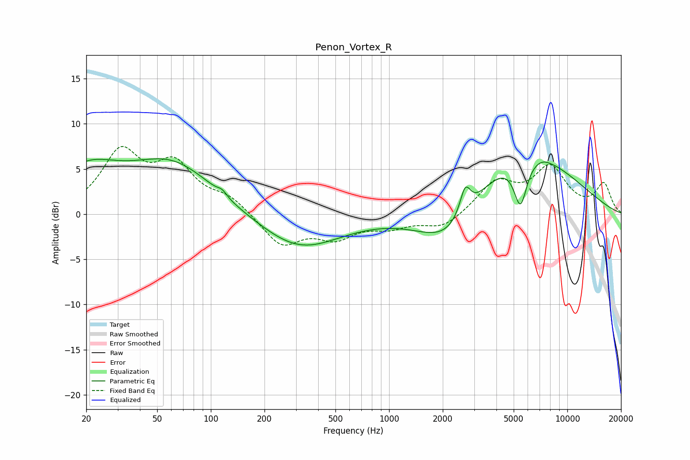

# Penon_Vortex_R
See [usage instructions](https://github.com/jaakkopasanen/AutoEq#usage) for more options and info.

### Parametric EQs
Apply preamp of -6.2 dB when using parametric equalizer.

|   # | Type    |   Fc (Hz) |    Q |   Gain (dB) |
|-----|---------|-----------|------|-------------|
|   1 | Peaking |        20 | 0.77 |         4.4 |
|   2 | Peaking |        28 | 1.56 |        -0   |
|   3 | Peaking |        61 | 0.6  |         5.5 |
|   4 | Peaking |       116 | 5.91 |         0.5 |
|   5 | Peaking |       314 | 0.62 |        -3.9 |
|   6 | Peaking |      2187 | 0.79 |        -5.2 |
|   7 | Peaking |      2673 | 4.7  |         3.1 |
|   8 | Peaking |      5455 | 3.68 |        -5.3 |
|   9 | Peaking |      5508 | 0.46 |         7.7 |
|  10 | Peaking |      7259 | 3.52 |         0.2 |

### Fixed Band EQs
When using fixed band (also called graphic) equalizer, apply preamp of **-7.6 dB** (if available) and set gains manually with these parameters.

|   # | Type    |   Fc (Hz) |    Q |   Gain (dB) |
|-----|---------|-----------|------|-------------|
|   1 | Peaking |        31 | 1.41 |         6.5 |
|   2 | Peaking |        62 | 1.41 |         4.9 |
|   3 | Peaking |       125 | 1.41 |         1.7 |
|   4 | Peaking |       250 | 1.41 |        -3.4 |
|   5 | Peaking |       500 | 1.41 |        -2.3 |
|   6 | Peaking |      1000 | 1.41 |        -1.2 |
|   7 | Peaking |      2000 | 1.41 |        -1.6 |
|   8 | Peaking |      4000 | 1.41 |         3.4 |
|   9 | Peaking |      8000 | 1.41 |         4.9 |
|  10 | Peaking |     16000 | 1.41 |         3.2 |

### Graphs

