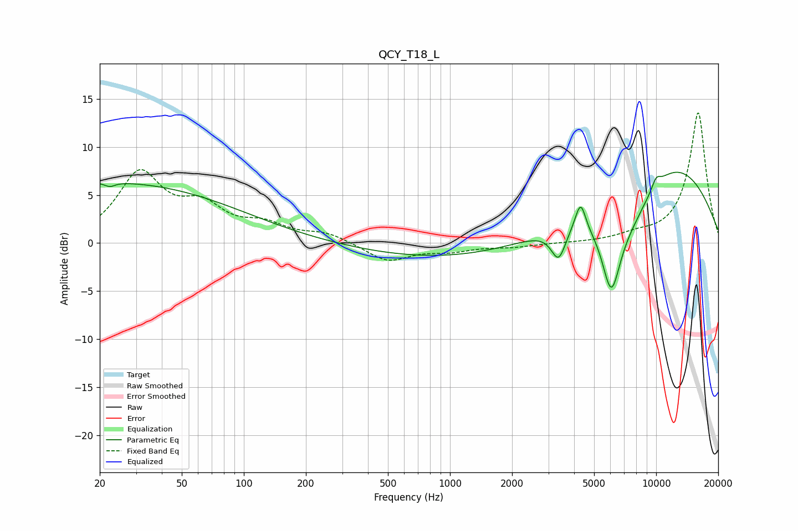

# QCY_T18_L
See [usage instructions](https://github.com/jaakkopasanen/AutoEq#usage) for more options and info.

### Parametric EQs
Apply preamp of -7.5 dB when using parametric equalizer.

|   # | Type    |   Fc (Hz) |    Q |   Gain (dB) |
|-----|---------|-----------|------|-------------|
|   1 | Peaking |        21 | 0.2  |         6.3 |
|   2 | Peaking |        22 | 5.87 |        -0.4 |
|   3 | Peaking |      1315 | 0.27 |        -1.9 |
|   4 | Peaking |      3363 | 3.97 |        -3.2 |
|   5 | Peaking |      4317 | 5.21 |         3.6 |
|   6 | Peaking |      4458 | 5.06 |        -0.6 |
|   7 | Peaking |      6055 | 3.08 |        -7.1 |
|   8 | Peaking |      7290 | 0.87 |        -6.2 |
|   9 | Peaking |      9783 | 0.34 |        10.5 |
|  10 | Peaking |     10000 | 5.71 |         1   |

### Fixed Band EQs
When using fixed band (also called graphic) equalizer, apply preamp of **-13.6 dB** (if available) and set gains manually with these parameters.

|   # | Type    |   Fc (Hz) |    Q |   Gain (dB) |
|-----|---------|-----------|------|-------------|
|   1 | Peaking |        31 | 1.41 |         7   |
|   2 | Peaking |        62 | 1.41 |         3.2 |
|   3 | Peaking |       125 | 1.41 |         1.6 |
|   4 | Peaking |       250 | 1.41 |         0.9 |
|   5 | Peaking |       500 | 1.41 |        -1.9 |
|   6 | Peaking |      1000 | 1.41 |        -0.7 |
|   7 | Peaking |      2000 | 1.41 |        -0.4 |
|   8 | Peaking |      4000 | 1.41 |        -0   |
|   9 | Peaking |      8000 | 1.41 |         0.6 |
|  10 | Peaking |     16000 | 1.41 |        13.6 |

### Graphs

