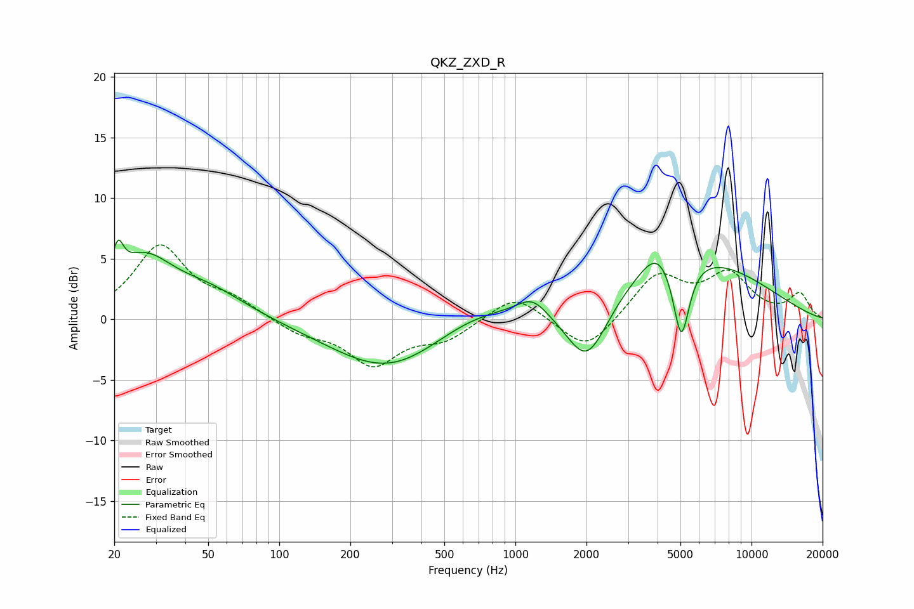

# QKZ_ZXD_R
See [usage instructions](https://github.com/jaakkopasanen/AutoEq#usage) for more options and info.

### Parametric EQs
Apply preamp of -6.6 dB when using parametric equalizer.

|   # | Type    |   Fc (Hz) |    Q |   Gain (dB) |
|-----|---------|-----------|------|-------------|
|   1 | Peaking |        21 | 5.99 |         2.7 |
|   2 | Peaking |        27 | 1.16 |         4.5 |
|   3 | Peaking |        50 | 0.84 |         2.1 |
|   4 | Peaking |       295 | 0.57 |        -4.4 |
|   5 | Peaking |       664 | 0.71 |         1.7 |
|   6 | Peaking |      1179 | 2.21 |         1.5 |
|   7 | Peaking |      2009 | 1.56 |        -5.4 |
|   8 | Peaking |      3986 | 2.02 |         2   |
|   9 | Peaking |      5039 | 4    |        -6.7 |
|  10 | Peaking |      5460 | 0.42 |         5.2 |

### Fixed Band EQs
When using fixed band (also called graphic) equalizer, apply preamp of **-6.2 dB** (if available) and set gains manually with these parameters.

|   # | Type    |   Fc (Hz) |    Q |   Gain (dB) |
|-----|---------|-----------|------|-------------|
|   1 | Peaking |        31 | 1.41 |         6   |
|   2 | Peaking |        62 | 1.41 |         1.3 |
|   3 | Peaking |       125 | 1.41 |        -1.1 |
|   4 | Peaking |       250 | 1.41 |        -3.6 |
|   5 | Peaking |       500 | 1.41 |        -1.5 |
|   6 | Peaking |      1000 | 1.41 |         2.2 |
|   7 | Peaking |      2000 | 1.41 |        -2.8 |
|   8 | Peaking |      4000 | 1.41 |         3.6 |
|   9 | Peaking |      8000 | 1.41 |         3.5 |
|  10 | Peaking |     16000 | 1.41 |         2   |

### Graphs

