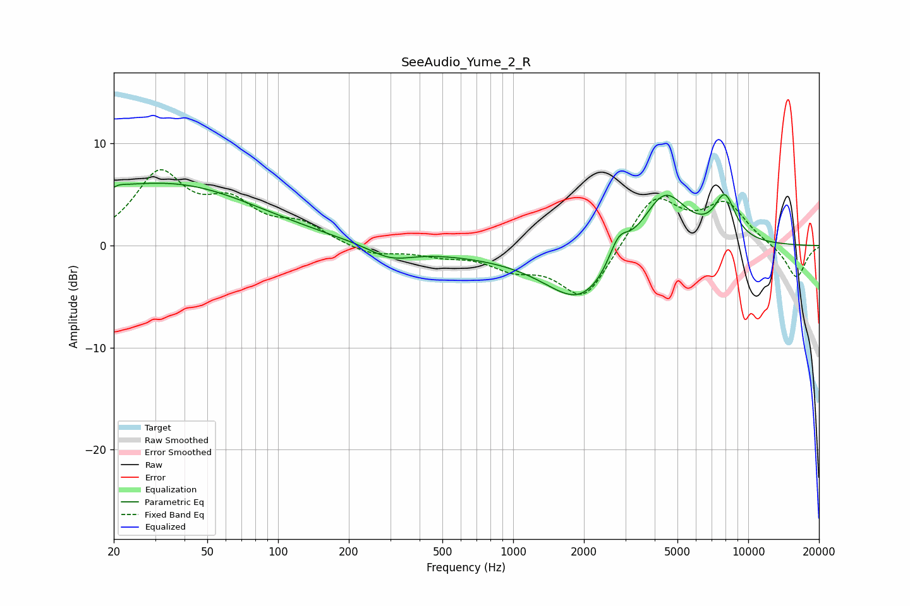

# SeeAudio_Yume_2_R
See [usage instructions](https://github.com/jaakkopasanen/AutoEq#usage) for more options and info.

### Parametric EQs
Apply preamp of -6.2 dB when using parametric equalizer.

|   # | Type    |   Fc (Hz) |    Q |   Gain (dB) |
|-----|---------|-----------|------|-------------|
|   1 | Peaking |        20 | 5.94 |        -3.4 |
|   2 | Peaking |        20 | 5.68 |         3.4 |
|   3 | Peaking |        23 | 0.24 |         5.1 |
|   4 | Peaking |        41 | 0.57 |         1.2 |
|   5 | Peaking |       300 | 1.49 |        -1.3 |
|   6 | Peaking |       848 | 0.39 |        -0.7 |
|   7 | Peaking |      1954 | 0.94 |        -5.3 |
|   8 | Peaking |      2807 | 3.39 |         2.5 |
|   9 | Peaking |      4386 | 1.43 |         5.9 |
|  10 | Peaking |      7958 | 2.91 |         4.2 |

### Fixed Band EQs
When using fixed band (also called graphic) equalizer, apply preamp of **-7.5 dB** (if available) and set gains manually with these parameters.

|   # | Type    |   Fc (Hz) |    Q |   Gain (dB) |
|-----|---------|-----------|------|-------------|
|   1 | Peaking |        31 | 1.41 |         6.7 |
|   2 | Peaking |        62 | 1.41 |         3.5 |
|   3 | Peaking |       125 | 1.41 |         1.8 |
|   4 | Peaking |       250 | 1.41 |        -1   |
|   5 | Peaking |       500 | 1.41 |        -0.7 |
|   6 | Peaking |      1000 | 1.41 |        -1.8 |
|   7 | Peaking |      2000 | 1.41 |        -5.3 |
|   8 | Peaking |      4000 | 1.41 |         5   |
|   9 | Peaking |      8000 | 1.41 |         3.9 |
|  10 | Peaking |     16000 | 1.41 |        -3.3 |

### Graphs

