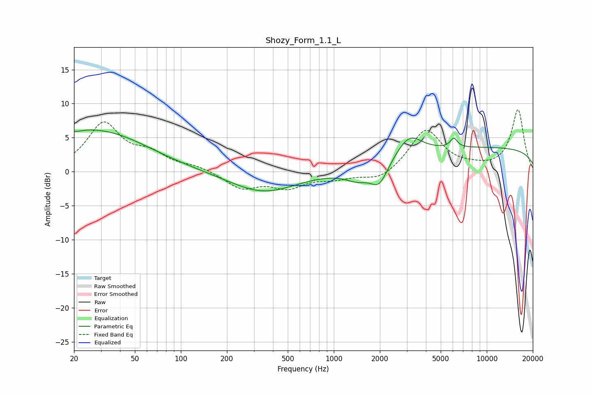

# Shozy_Form_1.1_L
See [usage instructions](https://github.com/jaakkopasanen/AutoEq#usage) for more options and info.

### Parametric EQs
Apply preamp of -6.2 dB when using parametric equalizer.

|   # | Type    |   Fc (Hz) |    Q |   Gain (dB) |
|-----|---------|-----------|------|-------------|
|   1 | Peaking |        20 | 5.66 |        -3.8 |
|   2 | Peaking |        20 | 6    |         3.9 |
|   3 | Peaking |        20 | 1.04 |         1.7 |
|   4 | Peaking |        33 | 0.48 |         5.2 |
|   5 | Peaking |       345 | 0.66 |        -3.1 |
|   6 | Peaking |      1444 | 1.62 |        -1.8 |
|   7 | Peaking |      1984 | 2.52 |        -3.1 |
|   8 | Peaking |      3105 | 1.71 |         3.1 |
|   9 | Peaking |      6090 | 6    |         1.4 |
|  10 | Peaking |     10000 | 0.18 |         3.5 |

### Fixed Band EQs
When using fixed band (also called graphic) equalizer, apply preamp of **-9.2 dB** (if available) and set gains manually with these parameters.

|   # | Type    |   Fc (Hz) |    Q |   Gain (dB) |
|-----|---------|-----------|------|-------------|
|   1 | Peaking |        31 | 1.41 |         6.9 |
|   2 | Peaking |        62 | 1.41 |         2.2 |
|   3 | Peaking |       125 | 1.41 |         0.7 |
|   4 | Peaking |       250 | 1.41 |        -2.4 |
|   5 | Peaking |       500 | 1.41 |        -2.1 |
|   6 | Peaking |      1000 | 1.41 |        -0.9 |
|   7 | Peaking |      2000 | 1.41 |        -1.5 |
|   8 | Peaking |      4000 | 1.41 |         6.2 |
|   9 | Peaking |      8000 | 1.41 |         0.4 |
|  10 | Peaking |     16000 | 1.41 |         9.1 |

### Graphs

