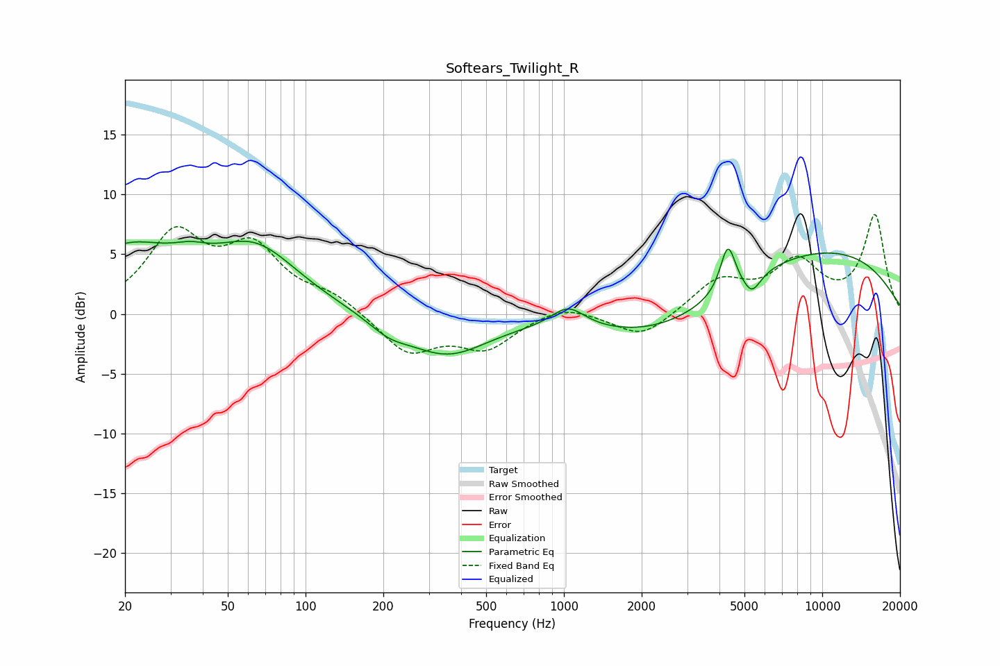

# Softears_Twilight_R
See [usage instructions](https://github.com/jaakkopasanen/AutoEq#usage) for more options and info.

### Parametric EQs
Apply preamp of -6.2 dB when using parametric equalizer.

|   # | Type    |   Fc (Hz) |    Q |   Gain (dB) |
|-----|---------|-----------|------|-------------|
|   1 | Peaking |        20 | 0.73 |         5   |
|   2 | Peaking |        36 | 2.09 |         0.9 |
|   3 | Peaking |        64 | 0.83 |         5.1 |
|   4 | Peaking |       209 | 1.78 |        -1.1 |
|   5 | Peaking |       352 | 0.88 |        -3.3 |
|   6 | Peaking |      1039 | 2.16 |         1.8 |
|   7 | Peaking |      2454 | 0.53 |        -2.9 |
|   8 | Peaking |      4312 | 4.86 |         3.9 |
|   9 | Peaking |      5342 | 4.1  |        -1.6 |
|  10 | Peaking |      9360 | 0.3  |         5.5 |

### Fixed Band EQs
When using fixed band (also called graphic) equalizer, apply preamp of **-8.4 dB** (if available) and set gains manually with these parameters.

|   # | Type    |   Fc (Hz) |    Q |   Gain (dB) |
|-----|---------|-----------|------|-------------|
|   1 | Peaking |        31 | 1.41 |         6.3 |
|   2 | Peaking |        62 | 1.41 |         5   |
|   3 | Peaking |       125 | 1.41 |         1.4 |
|   4 | Peaking |       250 | 1.41 |        -3.2 |
|   5 | Peaking |       500 | 1.41 |        -2.7 |
|   6 | Peaking |      1000 | 1.41 |         1   |
|   7 | Peaking |      2000 | 1.41 |        -2.1 |
|   8 | Peaking |      4000 | 1.41 |         2.7 |
|   9 | Peaking |      8000 | 1.41 |         4   |
|  10 | Peaking |     16000 | 1.41 |         8.1 |

### Graphs

