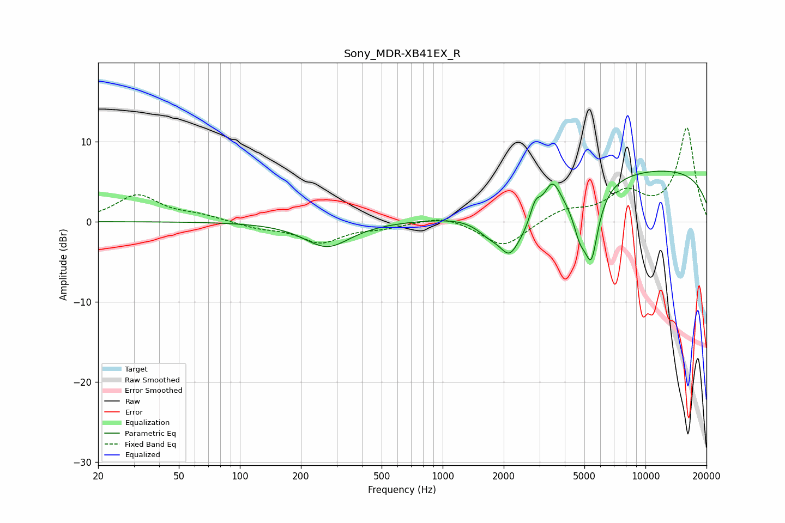

# Sony_MDR-XB41EX_R
See [usage instructions](https://github.com/jaakkopasanen/AutoEq#usage) for more options and info.

### Parametric EQs
Apply preamp of -6.4 dB when using parametric equalizer.

|   # | Type    |   Fc (Hz) |    Q |   Gain (dB) |
|-----|---------|-----------|------|-------------|
|   1 | Peaking |       270 | 1.25 |        -3.2 |
|   2 | Peaking |      1704 | 2.19 |        -1.7 |
|   3 | Peaking |      2130 | 3.09 |        -3.2 |
|   4 | Peaking |      2861 | 4.72 |         3.3 |
|   5 | Peaking |      2866 | 1.14 |        -5.7 |
|   6 | Peaking |      3453 | 3.03 |         5.1 |
|   7 | Peaking |      4747 | 4.19 |        -3.6 |
|   8 | Peaking |      5429 | 3.88 |        -8.5 |
|   9 | Peaking |      5695 | 5.43 |         0.5 |
|  10 | Peaking |     10000 | 0.18 |         6.6 |

### Fixed Band EQs
When using fixed band (also called graphic) equalizer, apply preamp of **-11.8 dB** (if available) and set gains manually with these parameters.

|   # | Type    |   Fc (Hz) |    Q |   Gain (dB) |
|-----|---------|-----------|------|-------------|
|   1 | Peaking |        31 | 1.41 |         3.3 |
|   2 | Peaking |        62 | 1.41 |         0.7 |
|   3 | Peaking |       125 | 1.41 |        -0.7 |
|   4 | Peaking |       250 | 1.41 |        -2.5 |
|   5 | Peaking |       500 | 1.41 |        -0.6 |
|   6 | Peaking |      1000 | 1.41 |         0.9 |
|   7 | Peaking |      2000 | 1.41 |        -3.2 |
|   8 | Peaking |      4000 | 1.41 |         1.4 |
|   9 | Peaking |      8000 | 1.41 |         3.3 |
|  10 | Peaking |     16000 | 1.41 |        11.6 |

### Graphs

