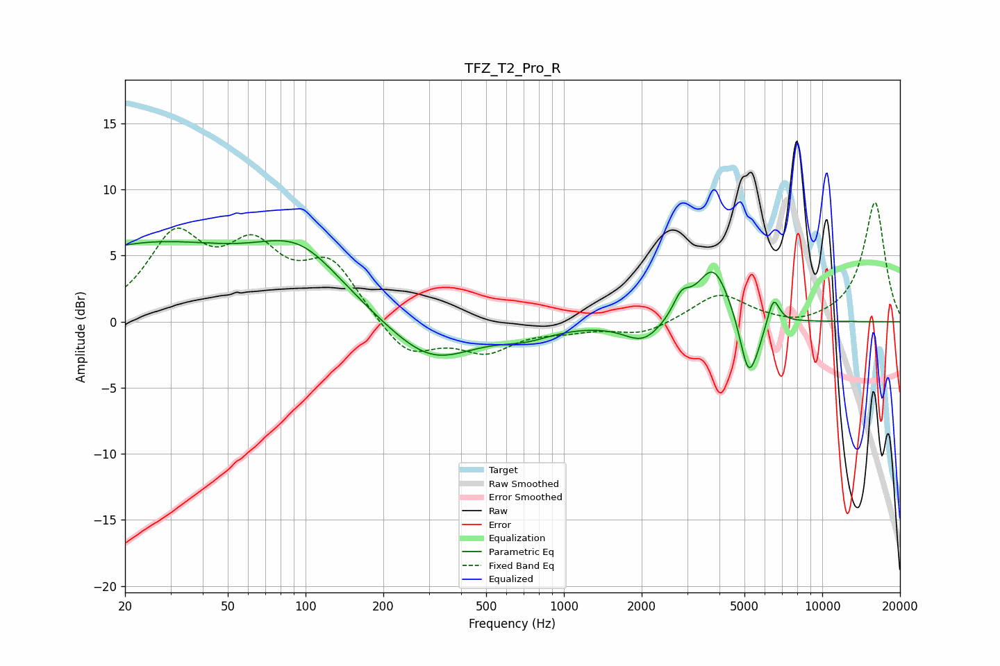

# TFZ_T2_Pro_R
See [usage instructions](https://github.com/jaakkopasanen/AutoEq#usage) for more options and info.

### Parametric EQs
Apply preamp of -6.2 dB when using parametric equalizer.

|   # | Type    |   Fc (Hz) |    Q |   Gain (dB) |
|-----|---------|-----------|------|-------------|
|   1 | Peaking |        24 | 0.34 |         5.6 |
|   2 | Peaking |        96 | 0.85 |         4   |
|   3 | Peaking |       306 | 0.85 |        -3.2 |
|   4 | Peaking |       713 | 1.36 |        -0.8 |
|   5 | Peaking |      2029 | 1.91 |        -1.6 |
|   6 | Peaking |      2851 | 4.32 |         1.5 |
|   7 | Peaking |      3789 | 2.17 |         4.3 |
|   8 | Peaking |      5171 | 4.14 |        -4.5 |
|   9 | Peaking |      5620 | 4.69 |        -0.8 |
|  10 | Peaking |      6479 | 5.97 |         2   |

### Fixed Band EQs
When using fixed band (also called graphic) equalizer, apply preamp of **-9.1 dB** (if available) and set gains manually with these parameters.

|   # | Type    |   Fc (Hz) |    Q |   Gain (dB) |
|-----|---------|-----------|------|-------------|
|   1 | Peaking |        31 | 1.41 |         6   |
|   2 | Peaking |        62 | 1.41 |         4.8 |
|   3 | Peaking |       125 | 1.41 |         4.2 |
|   4 | Peaking |       250 | 1.41 |        -2.7 |
|   5 | Peaking |       500 | 1.41 |        -2.1 |
|   6 | Peaking |      1000 | 1.41 |        -0.5 |
|   7 | Peaking |      2000 | 1.41 |        -1   |
|   8 | Peaking |      4000 | 1.41 |         2.2 |
|   9 | Peaking |      8000 | 1.41 |        -0.5 |
|  10 | Peaking |     16000 | 1.41 |         9.1 |

### Graphs

