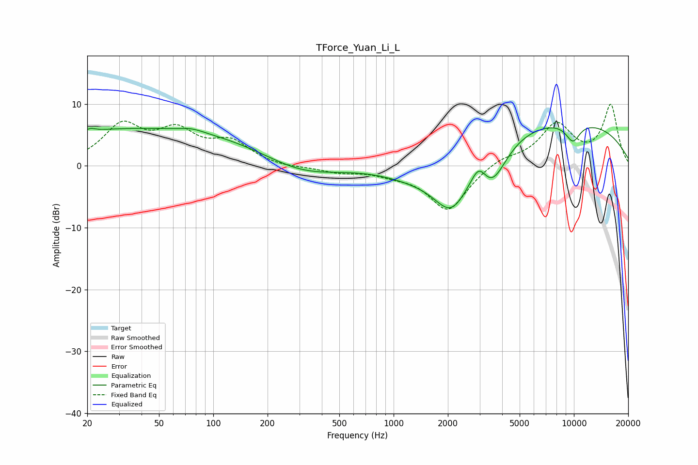

# TForce_Yuan_Li_L
See [usage instructions](https://github.com/jaakkopasanen/AutoEq#usage) for more options and info.

### Parametric EQs
Apply preamp of -6.3 dB when using parametric equalizer.

|   # | Type    |   Fc (Hz) |    Q |   Gain (dB) |
|-----|---------|-----------|------|-------------|
|   1 | Peaking |        21 | 5.92 |         0.4 |
|   2 | Peaking |        42 | 0.18 |         6.1 |
|   3 | Peaking |        76 | 2.07 |         0.6 |
|   4 | Peaking |       301 | 0.67 |        -2.6 |
|   5 | Peaking |      1305 | 0.73 |        -2.5 |
|   6 | Peaking |      2093 | 1.27 |        -9   |
|   7 | Peaking |      2969 | 3.34 |         3.1 |
|   8 | Peaking |      3514 | 1.71 |        -6.1 |
|   9 | Peaking |      7395 | 0.21 |         7.8 |
|  10 | Peaking |      9865 | 2.96 |        -3.1 |

### Fixed Band EQs
When using fixed band (also called graphic) equalizer, apply preamp of **-10.0 dB** (if available) and set gains manually with these parameters.

|   # | Type    |   Fc (Hz) |    Q |   Gain (dB) |
|-----|---------|-----------|------|-------------|
|   1 | Peaking |        31 | 1.41 |         6.2 |
|   2 | Peaking |        62 | 1.41 |         4.9 |
|   3 | Peaking |       125 | 1.41 |         3.5 |
|   4 | Peaking |       250 | 1.41 |        -0.4 |
|   5 | Peaking |       500 | 1.41 |        -0.9 |
|   6 | Peaking |      1000 | 1.41 |        -0.9 |
|   7 | Peaking |      2000 | 1.41 |        -7.3 |
|   8 | Peaking |      4000 | 1.41 |         1.3 |
|   9 | Peaking |      8000 | 1.41 |         6.5 |
|  10 | Peaking |     16000 | 1.41 |         9.7 |

### Graphs

