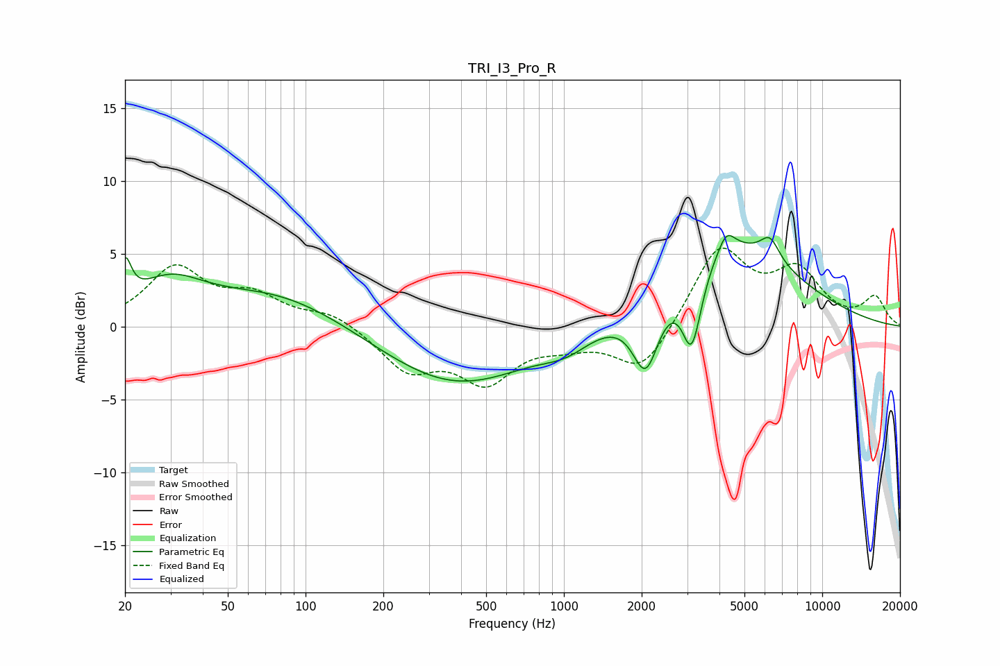

# TRI_I3_Pro_R
See [usage instructions](https://github.com/jaakkopasanen/AutoEq#usage) for more options and info.

### Parametric EQs
Apply preamp of -6.4 dB when using parametric equalizer.

|   # | Type    |   Fc (Hz) |    Q |   Gain (dB) |
|-----|---------|-----------|------|-------------|
|   1 | Peaking |        20 | 6    |         2.8 |
|   2 | Peaking |        29 | 1.07 |         2.6 |
|   3 | Peaking |        78 | 0.52 |         2.4 |
|   4 | Peaking |       382 | 0.49 |        -4.1 |
|   5 | Peaking |      1025 | 1.47 |        -1.1 |
|   6 | Peaking |      2075 | 2.71 |        -4.9 |
|   7 | Peaking |      3126 | 3.7  |        -5.4 |
|   8 | Peaking |      4256 | 4.3  |         1.4 |
|   9 | Peaking |      4270 | 0.55 |         5.9 |
|  10 | Peaking |      6275 | 3.74 |         1.5 |

### Fixed Band EQs
When using fixed band (also called graphic) equalizer, apply preamp of **-5.5 dB** (if available) and set gains manually with these parameters.

|   # | Type    |   Fc (Hz) |    Q |   Gain (dB) |
|-----|---------|-----------|------|-------------|
|   1 | Peaking |        31 | 1.41 |         3.9 |
|   2 | Peaking |        62 | 1.41 |         1.8 |
|   3 | Peaking |       125 | 1.41 |         0.9 |
|   4 | Peaking |       250 | 1.41 |        -2.8 |
|   5 | Peaking |       500 | 1.41 |        -3.5 |
|   6 | Peaking |      1000 | 1.41 |        -0.9 |
|   7 | Peaking |      2000 | 1.41 |        -3.2 |
|   8 | Peaking |      4000 | 1.41 |         5.4 |
|   9 | Peaking |      8000 | 1.41 |         3.5 |
|  10 | Peaking |     16000 | 1.41 |         1.9 |

### Graphs

