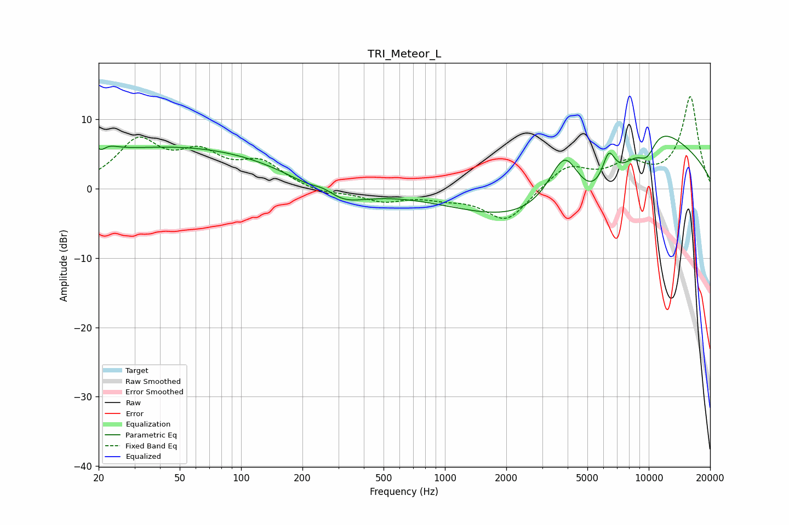

# TRI_Meteor_L
See [usage instructions](https://github.com/jaakkopasanen/AutoEq#usage) for more options and info.

### Parametric EQs
Apply preamp of -7.7 dB when using parametric equalizer.

|   # | Type    |   Fc (Hz) |    Q |   Gain (dB) |
|-----|---------|-----------|------|-------------|
|   1 | Peaking |        20 | 2.96 |         4.1 |
|   2 | Peaking |        20 | 4.85 |        -3.1 |
|   3 | Peaking |        49 | 0.25 |         6   |
|   4 | Peaking |       257 | 2.1  |         1.9 |
|   5 | Peaking |       279 | 1.04 |        -4.1 |
|   6 | Peaking |      3877 | 1.44 |        11.5 |
|   7 | Peaking |      5058 | 0.4  |       -15.9 |
|   8 | Peaking |      6363 | 4.1  |         4.7 |
|   9 | Peaking |      9809 | 2.63 |        -3.6 |
|  10 | Peaking |     10000 | 0.46 |        17   |

### Fixed Band EQs
When using fixed band (also called graphic) equalizer, apply preamp of **-13.4 dB** (if available) and set gains manually with these parameters.

|   # | Type    |   Fc (Hz) |    Q |   Gain (dB) |
|-----|---------|-----------|------|-------------|
|   1 | Peaking |        31 | 1.41 |         6.5 |
|   2 | Peaking |        62 | 1.41 |         4.3 |
|   3 | Peaking |       125 | 1.41 |         3.5 |
|   4 | Peaking |       250 | 1.41 |        -0.8 |
|   5 | Peaking |       500 | 1.41 |        -1.7 |
|   6 | Peaking |      1000 | 1.41 |        -1   |
|   7 | Peaking |      2000 | 1.41 |        -4.7 |
|   8 | Peaking |      4000 | 1.41 |         3.3 |
|   9 | Peaking |      8000 | 1.41 |         3   |
|  10 | Peaking |     16000 | 1.41 |        13.2 |

### Graphs

