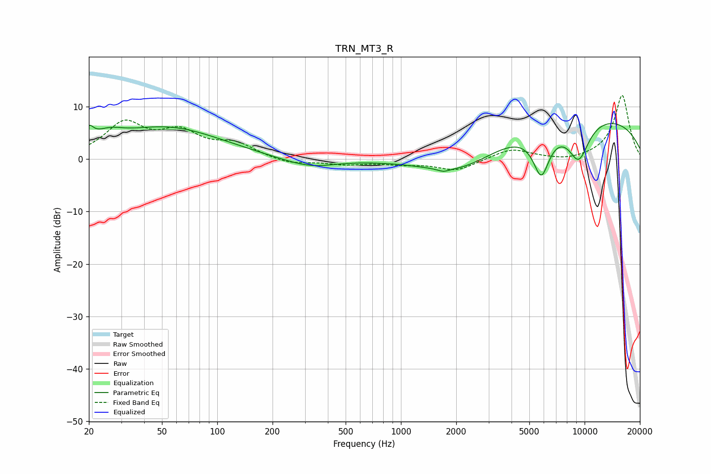

# TRN_MT3_R
See [usage instructions](https://github.com/jaakkopasanen/AutoEq#usage) for more options and info.

### Parametric EQs
Apply preamp of -6.9 dB when using parametric equalizer.

|   # | Type    |   Fc (Hz) |    Q |   Gain (dB) |
|-----|---------|-----------|------|-------------|
|   1 | Peaking |        20 | 5.73 |         2.6 |
|   2 | Peaking |        26 | 1.83 |         2   |
|   3 | Peaking |        53 | 0.47 |         6   |
|   4 | Peaking |       296 | 0.89 |        -1.4 |
|   5 | Peaking |       347 | 1.44 |        -0.4 |
|   6 | Peaking |      1707 | 4.85 |        -0.5 |
|   7 | Peaking |      2164 | 0.62 |        -6.2 |
|   8 | Peaking |      5811 | 2.95 |        -8.6 |
|   9 | Peaking |      8567 | 0.2  |         8.9 |
|  10 | Peaking |      9283 | 2.1  |        -7.5 |

### Fixed Band EQs
When using fixed band (also called graphic) equalizer, apply preamp of **-12.2 dB** (if available) and set gains manually with these parameters.

|   # | Type    |   Fc (Hz) |    Q |   Gain (dB) |
|-----|---------|-----------|------|-------------|
|   1 | Peaking |        31 | 1.41 |         6.5 |
|   2 | Peaking |        62 | 1.41 |         4.5 |
|   3 | Peaking |       125 | 1.41 |         2.6 |
|   4 | Peaking |       250 | 1.41 |        -1   |
|   5 | Peaking |       500 | 1.41 |        -0.9 |
|   6 | Peaking |      1000 | 1.41 |        -0.8 |
|   7 | Peaking |      2000 | 1.41 |        -2.2 |
|   8 | Peaking |      4000 | 1.41 |         2   |
|   9 | Peaking |      8000 | 1.41 |        -0.5 |
|  10 | Peaking |     16000 | 1.41 |        12.3 |

### Graphs

