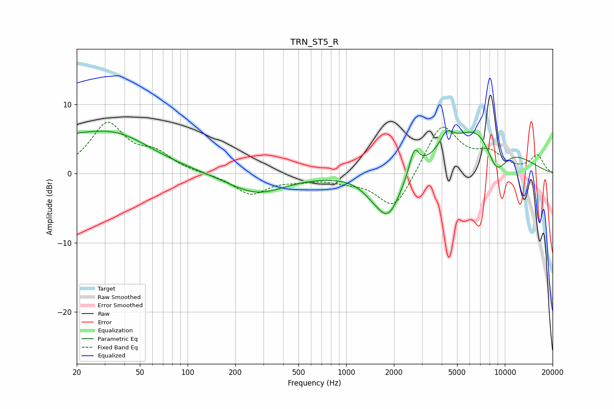

# TRN_ST5_R
See [usage instructions](https://github.com/jaakkopasanen/AutoEq#usage) for more options and info.

### Parametric EQs
Apply preamp of -6.3 dB when using parametric equalizer.

|   # | Type    |   Fc (Hz) |    Q |   Gain (dB) |
|-----|---------|-----------|------|-------------|
|   1 | Peaking |        20 | 5.79 |         0.4 |
|   2 | Peaking |        21 | 1.18 |         1.7 |
|   3 | Peaking |        35 | 0.59 |         5.4 |
|   4 | Peaking |       272 | 0.79 |        -2.9 |
|   5 | Peaking |      1448 | 2.09 |        -0.9 |
|   6 | Peaking |      1840 | 1.73 |        -6.4 |
|   7 | Peaking |      2684 | 4.68 |         3.6 |
|   8 | Peaking |      4289 | 3.39 |         2.3 |
|   9 | Peaking |      7423 | 0.7  |         9.2 |
|  10 | Peaking |      8785 | 1.61 |        -7.2 |

### Fixed Band EQs
When using fixed band (also called graphic) equalizer, apply preamp of **-7.5 dB** (if available) and set gains manually with these parameters.

|   # | Type    |   Fc (Hz) |    Q |   Gain (dB) |
|-----|---------|-----------|------|-------------|
|   1 | Peaking |        31 | 1.41 |         7   |
|   2 | Peaking |        62 | 1.41 |         2.4 |
|   3 | Peaking |       125 | 1.41 |        -0.1 |
|   4 | Peaking |       250 | 1.41 |        -3   |
|   5 | Peaking |       500 | 1.41 |        -0.7 |
|   6 | Peaking |      1000 | 1.41 |        -0.8 |
|   7 | Peaking |      2000 | 1.41 |        -5.5 |
|   8 | Peaking |      4000 | 1.41 |         7.3 |
|   9 | Peaking |      8000 | 1.41 |         2.5 |
|  10 | Peaking |     16000 | 1.41 |         2.5 |

### Graphs

